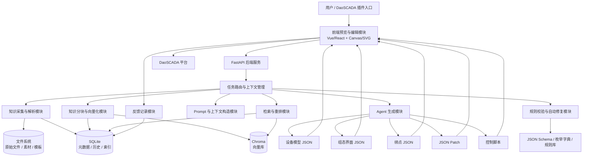
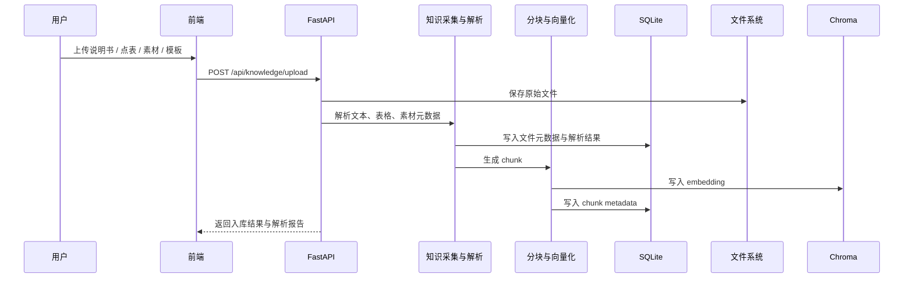
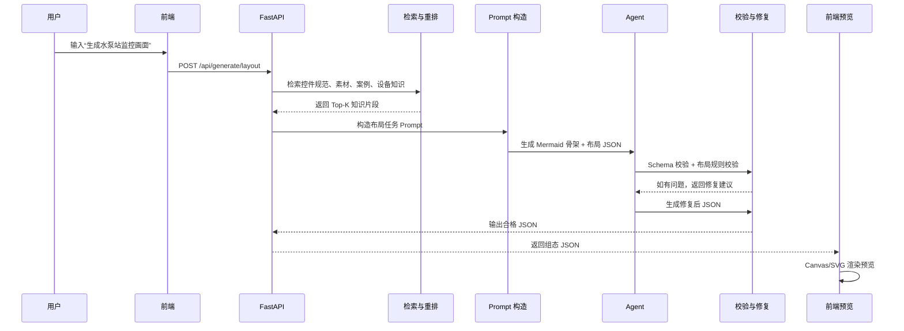
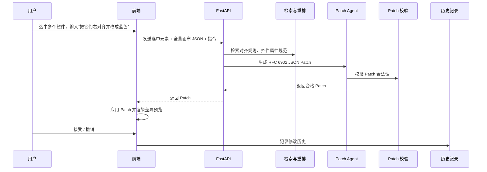
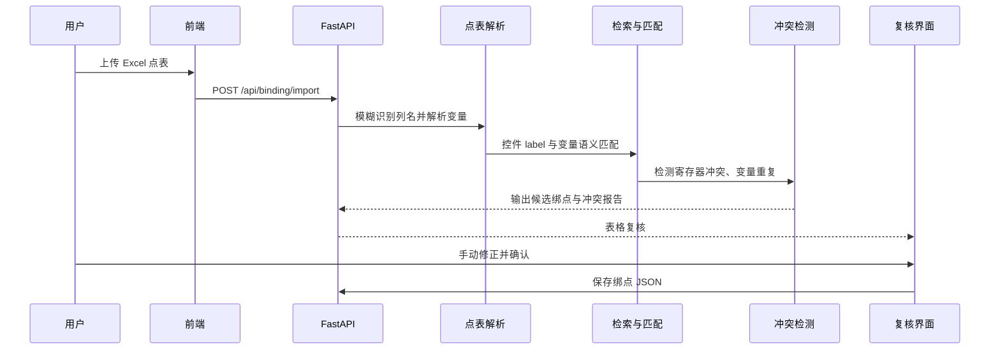
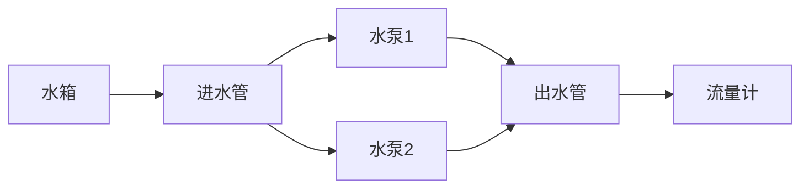

# 工业测控代码生成软件设计方案

## 1. 方案概述

本方案面向 DaoSCADA 平台，建设一套基于 **RAG + 规则约束 + Agent 生成 + 前端预览插件** 的工业测控代码生成软件。系统通过采集设备说明书、点表、控件素材、脚本模板、DaoSCADA 组态规范等知识，构建本地可检索知识库，并由 AI Agent 自动生成以下内容：

* DaoSCADA 设备模型；
* 组态界面 JSON；
* 设备模型与 PLC 变量绑点 JSON；
* DaoSCADA 控制脚本；
* 微调操作 JSON Patch；
* 工业风格控件素材；
* 生成过程、修改过程和人工反馈记录。

系统采用 **FastAPI + SQLite + 文件系统 + Chroma + Vue/React + Canvas/SVG** 架构，支持离线运行、本地知识沉淀、规则强校验、插件化集成和人工复核。

---

## 2. 总体技术路线

### 2.1 核心设计思想

系统不让大模型直接“自由生成最终结果”，而是采用以下受控生成链路：

```text
原始资料
  ↓
知识采集与解析
  ↓
知识分块与向量化
  ↓
SQLite / 文件系统 / Chroma 本地知识库
  ↓
任务检索与重排
  ↓
Prompt 与上下文构造
  ↓
Agent 生成 JSON / JSON Patch / 脚本
  ↓
Schema 校验 + 规则校验 + 自动修复
  ↓
前端预览 / 人工确认 / 插件写入 DaoSCADA
  ↓
反馈记录与知识沉淀
```

### 2.2 总体架构



---

## 3. 系统边界与主要能力

### 3.1 输入

系统支持以下输入：

| 输入类型        | 示例                               | 用途               |
| ----------- | -------------------------------- | ---------------- |
| 设备说明书       | PDF、Word、TXT、HTML                | 生成设备模型、控制脚本、变量说明 |
| PLC 点表      | Excel、CSV                        | 生成绑点关系、变量库       |
| DaoSCADA 规范 | JSON Schema、枚举字典、控件说明            | 约束生成结果           |
| 控件素材        | SVG、PNG、JSON 描述                  | 组态界面生成、素材复用      |
| 脚本模板        | JS / Python-like / DaoSCADA 脚本模板 | 控制脚本生成           |
| 用户自然语言      | “生成一个水泵站监控画面”                    | 触发任务生成           |
| 项目上下文       | 当前画布、已有控件、设备模型                   | 微调、增量生成、绑点       |

### 3.2 输出

| 输出类型  | 格式                        | 说明                                 |
| ----- | ------------------------- | ---------------------------------- |
| 设备模型  | JSON                      | DaoSCADA 可识别的设备模型结构                |
| 组态界面  | JSON                      | 符合 canvas / control / binding 三层结构 |
| 绑点文件  | JSON                      | 控件属性与 PLC 变量绑定关系                   |
| 微调差异包 | JSON Patch, RFC 6902      | 前端局部修改，不返回全量 JSON                  |
| 控制脚本  | DaoSCADA 支持脚本格式           | 联锁、启停、报警、状态判断等                     |
| 控件素材  | PNG / SVG + metadata JSON | 工业风格控件图标                           |
| 校验报告  | JSON / HTML / CLI 文本      | 字段缺失、类型错误、枚举越界、布局冲突等               |
| 操作历史  | SQLite 记录                 | 生成、修改、撤销、确认、人工反馈                   |

---

## 4. 端到端业务流程

## 4.1 知识入库流程



---

## 4.2 组态界面自动生成流程



---

## 4.3 微调流程



---

## 4.4 数据绑点流程



---

# 5. 模块详细设计

---

# 5.1 知识采集与解析模块

## 5.1.1 目标

将说明书、点表、素材、脚本模板、规则文档等原始资料转化为可检索、可追踪、可复用的结构化知识，统一输出为 **JSON / JSONL** 文件，并同步写入 SQLite 元数据库。

主要目标：

1. 解析设备说明书，抽取设备名称、型号、参数、通信协议、变量、报警、控制逻辑；
2. 解析 PLC 点表，抽取变量名、数据类型、寄存器地址、单位、描述、上下限；
3. 解析控件素材，抽取控件类型、风格、尺寸、状态、适用设备；
4. 解析脚本模板，抽取脚本用途、输入变量、输出动作、适用场景；
5. 解析 DaoSCADA 规范，抽取 JSON Schema、枚举值、控件属性、绑定规则；
6. 输出标准化 JSON / JSONL，为后续 RAG 检索提供基础数据。

---

## 5.1.2 策略

### 1. 文件类型分类解析

| 文件类型             | 解析策略              | 输出内容         |
| ---------------- | ----------------- | ------------ |
| PDF / Word / TXT | 文本抽取、章节识别、表格识别    | 设备描述、参数、控制逻辑 |
| Excel / CSV      | 表头模糊匹配、字段归一化      | 点表变量         |
| PNG / SVG        | 文件属性读取、尺寸检测、元数据登记 | 控件素材         |
| JSON Schema      | Schema 解析、字段约束提取  | 规则知识         |
| 脚本模板             | 模板变量识别、注释解析       | 脚本知识         |
| 枚举字典             | 枚举值硬编码入库          | 枚举约束         |

### 2. 字段标准化

点表中常见字段名称可能不一致，例如：

| 原始字段              | 标准字段               |
| ----------------- | ------------------ |
| 变量名、TagName、点名、名称 | `variable_name`    |
| 数据类型、类型、DataType  | `data_type`        |
| 地址、寄存器、Register   | `register_address` |
| 描述、说明、备注          | `description`      |
| 单位、Unit           | `unit`             |

通过字段别名字典进行模糊映射，无法确定的字段进入人工确认队列。

### 3. 知识来源可追溯

每条解析出的知识都必须携带来源信息：

```json
{
  "source_file_id": "file_20260508_001",
  "source_file_name": "水泵控制柜说明书.pdf",
  "source_type": "manual",
  "page": 12,
  "section": "3.2 控制逻辑",
  "parser_version": "v1.0.0"
}
```

### 4. 解析结果分层保存

解析结果分为三层：

```text
原始文件层：保存上传文件
解析文档层：保存完整文本、表格、素材元数据
标准知识层：保存设备、变量、控件、脚本、规则等结构化结果
```

---

## 5.1.3 流程

```text
1. 用户上传文件；
2. 系统生成 file_id，并保存原始文件到文件系统；
3. 根据文件扩展名和 MIME 类型选择解析器；
4. 执行文本、表格、图片、Schema、模板解析；
5. 对字段名称、单位、数据类型、枚举值进行标准化；
6. 生成标准 JSON / JSONL；
7. 将解析结果写入 SQLite；
8. 生成解析报告；
9. 将解析后的文本和结构化知识交给分块模块。
```

---

## 5.1.4 输出示例

### 设备说明书解析输出

```json
{
  "doc_id": "doc_pump_manual_001",
  "doc_type": "device_manual",
  "device": {
    "name": "循环水泵",
    "model": "PUMP-X100",
    "manufacturer": "unknown",
    "protocol": "Modbus TCP"
  },
  "parameters": [
    {
      "name": "额定功率",
      "value": "7.5",
      "unit": "kW"
    }
  ],
  "control_logic": [
    {
      "name": "远程启动",
      "condition": "remote_enable == true && fault == false",
      "action": "write start_cmd = 1"
    }
  ],
  "source": {
    "file_id": "file_001",
    "page": 8,
    "section": "控制逻辑"
  }
}
```

### 点表解析输出

```json
{
  "variable_id": "var_pump01_run",
  "variable_name": "Pump_01_Run",
  "display_name": "水泵1运行状态",
  "data_type": "bool",
  "register_address": "40001.0",
  "unit": "",
  "description": "水泵1运行反馈",
  "device_name": "水泵1",
  "source": {
    "file_id": "point_table_001",
    "sheet": "DI",
    "row": 12
  }
}
```

---

# 5.2 知识分块与向量化模块

## 5.2.1 目标

将解析后的文本、表格、控件、变量、脚本、案例和规则转化为适合 RAG 检索的 **chunk + embedding + metadata**，形成多类型知识索引。

主要目标：

1. 控制 RAG 检索粒度，避免检索内容过大或过碎；
2. 支持按任务类型召回不同知识；
3. 为设备建模、布局生成、绑点、脚本生成、微调 Patch 提供上下文；
4. 支持 Chroma 本地向量检索；
5. 保证每个 chunk 可追溯到原始文件、章节、表格行、素材文件。

---

## 5.2.2 策略

### 1. 按知识类型分块

| 知识类型        | 分块方式                         | 推荐粒度                       |
| ----------- | ---------------------------- | -------------------------- |
| 说明书文本       | 按章节、标题、语义段落分块                | 300～800 字                  |
| 设备参数        | 每个参数组一个 chunk                | 1 个参数表                     |
| 点表变量        | 每个变量一条 chunk，设备变量组另建聚合 chunk | 1 行 / 1 组                  |
| 控件素材        | 每个素材一个 chunk                 | 1 个控件                      |
| 脚本模板        | 每个模板一个 chunk                 | 1 个模板                      |
| JSON Schema | 按结构节点分块                      | canvas / control / binding |
| 枚举字典        | 按枚举类别分块                      | 1 个枚举类                     |
| 历史案例        | 按任务结果分块                      | 1 个完整案例或子区域                |

### 2. 任务感知 metadata

每个 chunk 都要包含 `task_scope`，用于检索过滤。

```json
{
  "chunk_id": "chunk_000123",
  "doc_id": "doc_pump_manual_001",
  "chunk_type": "device_variable",
  "task_scope": [
    "device_model_generation",
    "binding_generation",
    "script_generation"
  ],
  "device_type": "pump",
  "language": "zh-CN",
  "project_id": "project_demo",
  "source_file_id": "file_001",
  "hash": "sha256_xxx"
}
```

### 3. 控件与素材特殊向量化

控件素材不仅保存文本描述，还要保存其标签化描述：

```json
{
  "asset_id": "asset_pump_status_light_green",
  "asset_type": "indicator_light",
  "device_type": "pump",
  "state": "running",
  "style": "industrial_flat",
  "size": {
    "width": 128,
    "height": 128
  },
  "text_for_embedding": "水泵 运行 状态 指示灯 绿色 工业风格 扁平化 图标"
}
```

### 4. 变量语义增强

点表变量要进行中文、英文、缩写、编号统一处理。

示例：

```text
Pump_01_Run
→ pump 01 run
→ 水泵 1 运行
→ 水泵1运行状态
```

这样可以支持“水泵1”和“Pump_01”的模糊匹配。

### 5. 去重与版本控制

每个 chunk 计算内容 hash：

```text
chunk_hash = sha256(normalized_text + metadata_key_fields)
```

如果文件重复上传或内容未变化，不重复写入向量库；如果内容变化，生成新版本并保留旧版本索引。

---

## 5.2.3 流程

```text
---
config:
  layout: dagre
  look: neo
  theme: mc
  fontFamily: '''Recursive Variable'', sans-serif'
  themeVariables:
    fontFamily: '''Recursive Variable'', sans-serif'
---
flowchart TB
    A(["`**知识采集模块输出**`"]) --> B{"根据 chunk_type <br>选择分块策略"}
    B --> C["`**生成 normalized_text**`"]
    C --> D["`**添加 task_scope、device_type 信息**`"]
    D --> E{"计算 chunk_hash <br>执行去重"}
    E -- 重复 --> Skip(["`**丢弃**`"])
    E -- 全新内容 --> F["`**调用 embedding 模型生成向量**`"]
    F --> G[("`**写入 Chroma 向量库**`")] & H[("`**写入 SQLite chunk 元数据表**`")]

     A:::input
     B:::decision
     C:::process
     D:::process
     E:::decision
     F:::process
     G:::db
     H:::db
    classDef input fill:#f3e5f5,stroke:#8e24aa,stroke-width:2px,color:#000
    classDef process fill:#e3f2fd,stroke:#1e88e5,stroke-width:2px,color:#000
    classDef decision fill:#fff3e0,stroke:#fb8c00,stroke-width:2px,color:#000
    classDef db fill:#e8f5e9,stroke:#43a047,stroke-width:2px,color:#000
```

---

## 5.2.4 输出示例

```json
{
  "chunk_id": "chunk_var_0001",
  "content": "变量 Pump_01_Run 表示水泵1运行反馈，数据类型 bool，寄存器地址 40001.0。",
  "embedding_id": "emb_0001",
  "metadata": {
    "chunk_type": "plc_variable",
    "task_scope": [
      "binding_generation",
      "script_generation"
    ],
    "device_type": "pump",
    "variable_name": "Pump_01_Run",
    "register_address": "40001.0",
    "data_type": "bool",
    "source_file_id": "point_table_001",
    "sheet": "DI",
    "row": 12
  }
}
```

---

# 5.3 知识库存储模块

## 5.3.1 目标

管理 SQLite、Chroma 和文件系统，将原始文件、解析结果、chunk、embedding、metadata、素材、脚本模板、历史案例统一沉淀为本地知识库。

主要目标：

1. 支持离线运行；
2. 支持本地知识检索；
3. 支持项目级、版本级、任务级隔离；
4. 支持原始文件、结构化数据、向量数据一致性管理；
5. 支持备份、恢复、清理和审计。

---

## 5.3.2 策略

### 1. 三层存储架构

```text
文件系统：
  - 原始说明书
  - Excel 点表
  - 控件素材
  - 脚本模板
  - 生成结果快照

SQLite：
  - 文件元数据
  - 解析结果索引
  - chunk 元数据
  - 项目信息
  - 生成历史
  - 反馈记录
  - 枚举字典索引

Chroma：
  - 文本 chunk 向量
  - 变量 chunk 向量
  - 控件素材 chunk 向量
  - 脚本模板 chunk 向量
  - 历史案例 chunk 向量
```

### 2. Chroma Collection 设计

建议按知识类型划分 collection：

| Collection        | 内容               |
| ----------------- | ---------------- |
| `manual_chunks`   | 设备说明书、工艺说明       |
| `schema_chunks`   | JSON Schema、规则说明 |
| `variable_chunks` | PLC 点表变量         |
| `asset_chunks`    | 控件素材描述           |
| `script_chunks`   | 脚本模板             |
| `case_chunks`     | 历史生成案例           |
| `feedback_chunks` | 人工修正和反馈样本        |

### 3. SQLite 核心表设计

#### `files`

| 字段           | 类型       | 说明                                             |
| ------------ | -------- | ---------------------------------------------- |
| `file_id`    | TEXT     | 文件唯一 ID                                        |
| `project_id` | TEXT     | 项目 ID                                          |
| `file_name`  | TEXT     | 原始文件名                                          |
| `file_type`  | TEXT     | manual / point_table / asset / schema / script |
| `file_path`  | TEXT     | 文件系统路径                                         |
| `file_hash`  | TEXT     | 文件 hash                                        |
| `created_at` | DATETIME | 上传时间                                           |
| `status`     | TEXT     | parsed / failed / pending                      |

#### `chunks`

| 字段                | 类型       | 说明                |
| ----------------- | -------- | ----------------- |
| `chunk_id`        | TEXT     | chunk ID          |
| `file_id`         | TEXT     | 来源文件              |
| `collection_name` | TEXT     | Chroma collection |
| `chunk_type`      | TEXT     | 知识类型              |
| `content_hash`    | TEXT     | 内容 hash           |
| `metadata_json`   | TEXT     | metadata          |
| `created_at`      | DATETIME | 创建时间              |

#### `generation_history`

| 字段                   | 类型       | 说明                                |
| -------------------- | -------- | --------------------------------- |
| `history_id`         | TEXT     | 历史 ID                             |
| `project_id`         | TEXT     | 项目 ID                             |
| `task_type`          | TEXT     | layout / binding / script / patch |
| `input_query`        | TEXT     | 用户输入                              |
| `retrieval_snapshot` | TEXT     | 检索结果快照                            |
| `output_json`        | TEXT     | 输出结果                              |
| `validation_report`  | TEXT     | 校验报告                              |
| `created_at`         | DATETIME | 创建时间                              |

#### `operation_history`

| 字段                | 类型       | 说明                               |
| ----------------- | -------- | -------------------------------- |
| `operation_id`    | TEXT     | 操作 ID                            |
| `canvas_id`       | TEXT     | 画布 ID                            |
| `operation_type`  | TEXT     | generate / patch / undo / accept |
| `before_snapshot` | TEXT     | 修改前 JSON                         |
| `patch_json`      | TEXT     | JSON Patch                       |
| `after_snapshot`  | TEXT     | 修改后 JSON                         |
| `operator`        | TEXT     | 操作人                              |
| `created_at`      | DATETIME | 操作时间                             |

---

## 5.3.3 流程

```text
---
config:
  layout: dagre
---
graph LR
    A([文件上传文件系统]) --> Fork{分发}
    
    Fork --> B[(数据写入 SQLite)]
    Fork --> C[(解析结果写入 SQLite)]
    Fork --> D[(chunk 内容和 metadata 写入 SQLite )]
    Fork --> E[(embedding 写入 Chroma )]
    Fork --> F[(结果写入 SQLite )]
    
    B --> Join{完毕}
    C --> Join
    D --> Join
    E --> Join
    F --> Join
    
    Join --> G([本地备份])

    %% 样式定义
    classDef file fill:#f3e5f5,stroke:#8e24aa,stroke-width:2px,color:#000
    classDef sqlite fill:#e3f2fd,stroke:#1e88e5,stroke-width:2px,color:#000
    classDef chroma fill:#e8f5e9,stroke:#43a047,stroke-width:2px,color:#000
    classDef backup fill:#fff3e0,stroke:#fb8c00,stroke-width:2px,color:#000
    classDef logic fill:#eceff1,stroke:#607d8b,stroke-width:2px,color:#000,stroke-dasharray: 5 5

    class A file;
    class B,C,D,F sqlite;
    class E chroma;
    class G backup;
    class Fork,Join logic;
```

---

## 5.3.4 文件系统目录建议

```text
data/
  projects/
    project_001/
      raw/
        manuals/
        point_tables/
        assets/
        schemas/
        scripts/
      parsed/
        manuals_json/
        point_tables_json/
        assets_json/
      generated/
        device_models/
        layouts/
        bindings/
        scripts/
        patches/
      snapshots/
      reports/
  chroma/
  sqlite/
    daoscada_ai.db
  backups/
```

---

# 5.4 检索与重排模块

## 5.4.1 目标

根据用户 Query、任务类型、当前项目上下文，从知识库中召回最相关的规范、设备、变量、素材、脚本模板和历史案例，并通过重排输出高质量 Top-K 上下文。

主要目标：

1. 支持任务感知检索；
2. 支持多路召回；
3. 支持语义相似度、关键词、规则过滤混合检索；
4. 支持控件素材复用，相似度大于 0.85 时优先复用；
5. 支持变量与控件匹配；
6. 支持检索结果可解释，输出匹配依据。

---

## 5.4.2 策略

### 1. 任务类型驱动检索

| 任务类型                      | 主要检索内容                              |
| ------------------------- | ----------------------------------- |
| `device_model_generation` | 设备说明书、设备参数、协议、变量说明、设备模型案例           |
| `layout_generation`       | 控件规范、素材、历史界面案例、布局规则、Schema          |
| `binding_generation`      | 控件列表、PLC 点表变量、同义词、历史绑点案例            |
| `script_generation`       | 控制逻辑、变量、脚本模板、设备手册                   |
| `patch_generation`        | 当前画布 JSON、选中控件、控件属性规范、JSON Patch 规则 |
| `asset_generation`        | 素材库、控件风格说明、设备类型词典                   |
| `validation_repair`       | Schema、枚举字典、规则说明、错误修复案例             |

### 2. 多路召回

每个任务至少执行三类召回：

```text
语义召回：基于 Chroma embedding 相似度；
关键词召回：基于 SQLite FTS 或 LIKE / BM25；
规则召回：基于 task_scope、device_type、project_id、chunk_type 过滤。
```

### 3. Query 改写与实体提取

用户输入：

```text
水泵运行状态指示灯
```

系统改写为：

```json
{
  "original_query": "水泵运行状态指示灯",
  "rewritten_queries": [
    "水泵 运行 状态 指示灯 工业控件",
    "pump running status indicator light",
    "设备类型: pump, 状态: running, 控件类型: indicator_light"
  ],
  "entities": {
    "device_type": "pump",
    "state": "running",
    "style": "industrial",
    "control_type": "indicator_light"
  }
}
```

### 4. 控件素材复用阈值

素材检索时采用如下规则：

```text
最高相似度 > 0.85：
  直接复用本地素材；

0.70 <= 最高相似度 <= 0.85：
  返回候选素材，由 Agent 判断是否改造复用；

最高相似度 < 0.70：
  调用文生图 API 生成新素材。
```

### 5. 变量匹配策略

绑点匹配采用组合评分：

```text
score = 0.40 * 语义相似度
      + 0.25 * 名称模糊匹配分
      + 0.15 * 设备编号匹配分
      + 0.10 * 数据类型兼容分
      + 0.10 * 寄存器分组一致性分
```

匹配结果必须输出依据，例如：

```json
{
  "control_id": "pump_01_status",
  "candidate_variable": "Pump_01_Run",
  "score": 0.91,
  "reason": [
    "控件标签包含“水泵1”",
    "变量名 Pump_01 与水泵1编号一致",
    "Run 与运行状态为同义词",
    "控件类型 indicator_light 与变量 bool 类型兼容"
  ]
}
```

### 6. 重排策略

初步召回后，使用以下规则重排：

1. 同一项目知识优先；
2. 同设备类型优先；
3. 来源为 Schema / 枚举 / 规则的约束知识强制保留；
4. 历史人工确认成功案例优先；
5. 最近版本优先；
6. 去除重复 chunk；
7. 压缩低价值长文本。

---

## 5.4.3 流程

```text
---
config:
  layout: dagre
---
flowchart TB
    A(["task_type, query, <br>project_id, 画布上下文"]) --> B["`**Query 改写、实体提取**`"]
    B --> C{"按任务类型选择 <br>collection 和过滤条件"}
    C -- 分支 --> D1["`**语义召回**`"] & D2["`**关键词召回**`"] & D3["`**规则召回**`"]
    D1 --> E["`**合并候选结果**`"]
    D2 --> E
    D3 --> E
    E --> F["`**任务规则和相似度重排**`"]
    F --> G["`**生成 Top-K 知识包**`"]
    G --> H1(["`**候选素材**`"]) & H2(["`**候选变量**`"])

     A:::input_output
     B:::process
     C:::decision
     D1:::recall
     D2:::recall
     D3:::recall
     E:::process
     F:::process
     G:::process
     H1:::input_output
     H2:::input_output
    classDef input_output fill:#f3e5f5,stroke:#8e24aa,stroke-width:2px,color:#000,font-size:18px
    classDef process fill:#e3f2fd,stroke:#1e88e5,stroke-width:2px,color:#000,font-size:18px
    classDef decision fill:#fff3e0,stroke:#fb8c00,stroke-width:2px,color:#000,font-size:18px
    classDef recall fill:#e8f5e9,stroke:#43a047,stroke-width:2px,color:#000,font-size:18px
    classDef subgraphStyle fill:#fafafa,stroke:#bdbdbd,stroke-width:2px,stroke-dasharray: 5 5,font-size:20px,font-weight:bold
```

---

## 5.4.4 输出示例

```json
{
  "task_type": "layout_generation",
  "query": "生成一个水泵站监控画面",
  "entities": {
    "scene": "pump_station",
    "device_types": ["pump", "valve", "flow_meter"],
    "layout_style": "industrial_scada"
  },
  "top_k": [
    {
      "chunk_id": "chunk_schema_control_001",
      "score": 1.0,
      "type": "schema_rule",
      "content": "control 必须包含 id、type、x、y、width、height..."
    },
    {
      "chunk_id": "chunk_case_pump_station_003",
      "score": 0.92,
      "type": "layout_case",
      "content": "历史案例：双泵一备一用水泵站布局..."
    }
  ]
}
```

---

# 5.5 Prompt 与上下文构造模块

## 5.5.1 目标

将检索结果、用户 Query、项目上下文、Schema 规则、枚举字典和任务要求压缩为结构化 Prompt，引导 Agent 生成稳定、合规、可校验的 JSON / JSON Patch / 脚本。

主要目标：

1. 控制大模型上下文长度；
2. 强制输出格式；
3. 防止生成枚举外字段；
4. 将 Schema、规则、素材、变量候选纳入上下文；
5. 按任务类型生成不同 Prompt；
6. 保证生成结果可被后续校验和修复。

---

## 5.5.2 策略

### 1. Prompt 模板按任务拆分

| 模板                          | 用途            |
| --------------------------- | ------------- |
| `device_model_prompt`       | 设备模型生成        |
| `layout_generation_prompt`  | 组态界面 JSON 生成  |
| `binding_generation_prompt` | 绑点 JSON 生成    |
| `script_generation_prompt`  | 控制脚本生成        |
| `patch_generation_prompt`   | JSON Patch 微调 |
| `asset_generation_prompt`   | 控件素材描述与文生图提示词 |
| `repair_prompt`             | 校验失败后的自动修复    |

### 2. Prompt 结构

每个 Prompt 统一采用以下结构：

```text
任务说明
  - 任务类型
  - 用户意图
  - 输出格式要求

强约束
  - JSON Schema 摘要
  - 枚举字典
  - 禁止项
  - 必填字段

项目上下文
  - 当前画布
  - 当前控件
  - 当前设备模型
  - 当前变量列表

检索知识
  - Top-K 规范
  - Top-K 变量
  - Top-K 素材
  - Top-K 案例

生成要求
  - 只输出 JSON / JSON Patch / 脚本
  - 不输出解释文本
  - 坐标必须为整数
  - 枚举必须来自字典
  - id 必须唯一
```

### 3. 上下文压缩

对检索结果按优先级压缩：

```text
P0：Schema、枚举、硬规则，不可丢弃；
P1：当前项目上下文，不可丢弃；
P2：候选变量、候选素材，优先保留；
P3：历史案例，可摘要；
P4：说明书长文本，可压缩为结构化要点。
```

### 4. 输出格式强制

组态界面生成任务要求：

```text
只能输出 JSON；
顶层必须包含 canvas、control、binding；
control 必须是数组；
binding 必须是数组；
所有控件坐标必须为整数；
所有枚举值必须来自 enum_dictionary；
不得生成不存在的控件类型。
```

微调任务要求：

```text
只能输出 RFC 6902 JSON Patch 数组；
不得输出全量 JSON；
不得修改未选中控件，除非用户明确要求；
Patch op 只能使用 add / remove / replace / move / copy / test；
每个 path 必须真实存在或符合 add 规则。
```

---

## 5.5.3 流程

```text
---
config:
  layout: dagre
---
graph TD
    %% 阶段一：输入与准备
    A([接收核心参数 <br> <small>task, query, 检索结果, 上下文</small>]) --> B[选择 Prompt 模板]
    
    %% 阶段二：上下文注入与处理
    B --> C[注入系统规则 <br> <small>Schema, 字典, 硬规则</small>]
    C --> D[注入画布上下文 <br> <small>控件, 变量, 素材</small>]
    D --> E[长文本摘要压缩]
    
    %% 阶段三：生成与输出
    E --> F[生成最终 Prompt]
    F --> G[(记录元数据 <br> <small>Token估算, 来源</small>)]
    G --> H([发送至 Agent 模块])

    %% 样式定义 (保留了放大字体的设置)
    classDef input_output fill:#f3e5f5,stroke:#8e24aa,stroke-width:2px,color:#000,font-size:18px,font-weight:bold
    classDef process fill:#e3f2fd,stroke:#1e88e5,stroke-width:2px,color:#000,font-size:18px,font-weight:bold
    classDef db fill:#e8f5e9,stroke:#43a047,stroke-width:2px,color:#000,font-size:18px,font-weight:bold

    %% 绑定样式
    class A,H input_output;
    class B,C,D,E,F process;
    class G db;
```

---

## 5.5.4 Prompt 片段示例

```text
你是 DaoSCADA 组态 JSON 生成 Agent。

任务：
根据用户需求生成工业水泵站监控画面。

强约束：
1. 输出必须是 JSON。
2. 顶层结构必须包含 canvas、control、binding。
3. control.type 只能从以下枚举中选择：
   ["pump", "valve", "pipe", "indicator_light", "text", "panel", "flow_meter", "button"]
4. 管路控件必须与设备控件存在连接关系。
5. 仪表和显示类控件默认放置在右侧面板区。
6. 坐标必须为整数，精度误差不得超过 1px。

用户需求：
生成一个包含两台水泵、一用一备、进出水管路、运行状态、故障状态、启停按钮、流量显示的水泵站监控画面。

输出：
只输出完整 JSON，不要输出解释。
```

---

# 5.6 Agent 生成模块

## 5.6.1 目标

基于 Prompt 和上下文，生成设备模型、布局 JSON、绑点 JSON、JSON Patch 和控制脚本，并通过多 Agent 分工降低任务复杂度。

主要目标：

1. 生成 DaoSCADA 设备模型；
2. 生成符合 Schema 的组态界面 JSON；
3. 生成控件与变量绑点 JSON；
4. 生成 RFC 6902 JSON Patch；
5. 生成 DaoSCADA 控制脚本；
6. 生成素材描述和文生图提示词；
7. 输出结果必须进入规则校验与自动修复模块。

---

## 5.6.2 策略

### 1. 多 Agent 分工

| Agent              | 职责                      |
| ------------------ | ----------------------- |
| `DeviceModelAgent` | 从说明书生成设备模型              |
| `LayoutAgent`      | 生成 Mermaid 骨架和组态布局 JSON |
| `BindingAgent`     | 生成控件与变量绑定关系             |
| `PatchAgent`       | 根据用户微调指令生成 JSON Patch   |
| `ScriptAgent`      | 生成控制脚本                  |
| `AssetAgent`       | 检索或生成控件素材               |
| `RepairAgent`      | 根据校验报告修复输出              |
| `ReviewAgent`      | 对生成结果做自检和解释性评分          |

### 2. 生成采用“计划—生成—校验—修复”闭环

```text
---
config:
  layout: dagre
---
flowchart LR
    A(["任务理解"]) --> B["结构化计划"]
    B --> C["初版结果"]
    C --> D{"Schema 校验"}
    D -- 通过 --> E{"规则校验"}
    D -- 失败 --> F["进入 RepairAgent"]
    E -- 失败 --> F
    F --> G{"修复轮次 < 3"}
    G -- 是 --> C
    G -- 否 --> H2(["❌输出失败报告"])
    E -- 通过 --> H1(["✅ 输出合格结果"])

    A:::process
    B:::process
    C:::process
    D:::decision
    E:::decision
    F:::repair
    G:::decision
    H1:::success
    H2:::fail

    classDef process fill:#e3f2fd,stroke:#1e88e5,stroke-width:2px,color:#000,font-size:18px,font-weight:bold
    classDef decision fill:#fff3e0,stroke:#fb8c00,stroke-width:2px,color:#000,font-size:18px,font-weight:bold
    classDef repair fill:#f3e5f5,stroke:#8e24aa,stroke-width:2px,color:#000,font-size:18px,font-weight:bold
    classDef success fill:#e8f5e9,stroke:#43a047,stroke-width:2px,color:#000,font-size:18px,font-weight:bold
    classDef fail fill:#ffebee,stroke:#e53935,stroke-width:2px,color:#000,font-size:18px,font-weight:bold
```

建议默认最大修复轮次为 3 次，避免无限循环。

### 3. 布局生成策略

布局生成采用两阶段：

```text
阶段一：生成 Mermaid / 流程图 DSL，描述设备和管路控制流骨架；
阶段二：根据骨架生成 canvas / control / binding JSON。
```

示例骨架：



坐标规划规则：

```text
1. 主流程从左到右或从上到下；
2. 水箱、管路、水泵按工艺流向排列；
3. 同类设备聚合，距离小于 200px；
4. 仪表、状态、报警、按钮放入右侧面板；
5. 元素数大于 20 时启用力导向图布局；
6. 坐标统一取整数；
7. 控件不得明显重叠；
8. 管路端点必须连接设备。
```

### 4. 大型场景兜底布局

当元素数量大于 20 时：

```text
1. Agent 先输出节点和边；
2. 后端调用 D3-force 或自实现力导向布局；
3. 生成初始坐标；
4. Agent 仅做微调，不从零排布；
5. 布局质检工具检测重叠、孤立节点、管路断连；
6. 如不合格，执行自动修复。
```

### 5. 绑点生成策略

```text
1. 读取当前画布 control；
2. 读取 PLC 点表变量；
3. 对控件 label、type、device_id、status 属性进行语义表示；
4. 对变量名、描述、地址、数据类型进行语义表示；
5. 生成候选匹配 Top-N；
6. 根据数据类型、设备编号、状态词进行规则过滤；
7. 输出默认 Top-1 绑定；
8. Top-1 低于阈值时进入人工复核。
```

### 6. Patch 生成策略

PatchAgent 只允许返回差异包：

```json
[
  {
    "op": "replace",
    "path": "/control/3/x",
    "value": 640
  },
  {
    "op": "replace",
    "path": "/control/4/x",
    "value": 640
  }
]
```

限制：

```text
1. 不返回全量 JSON；
2. 不修改未选中控件；
3. 不删除 binding 中仍被引用的控件，除非同步移除绑定；
4. Patch 应用前后均需通过 Schema 校验；
5. 前端必须支持接受和撤销。
```

---

## 5.6.3 流程

```text
1. 接收 Prompt 和任务上下文；
2. 根据 task_type 路由到对应 Agent；
3. Agent 生成结构化计划；
4. Agent 生成 JSON / JSON Patch / 脚本；
5. 调用规则校验与自动修复模块；
6. 若校验失败，将错误报告送入 RepairAgent；
7. RepairAgent 输出修复版本；
8. 再次校验；
9. 输出最终结果、生成日志和置信度。
---
config:
  layout: dagre
---
flowchart TB
    A(["Prompt 与上下文"]) --> B{"task_type 路由"}
    B --> C["Agent 计划与生成<br>JSON / JSON Patch / 脚本"]
    C --> D{"Schema + 规则校验"}
    D -- 通过 --> E(["输出最终结果"])
    D -- 失败 --> F[" RepairAgent 修复"]
    F --> G{"修复轮次 &lt; 3"}
    G -- 是 --> C
    G -- 否 --> H(["输出失败报告"])

     A:::process
     B:::decision
     C:::agent
     D:::decision
     E:::success
     F:::repair
     G:::decision
     H:::fail
    classDef process fill:#e3f2fd,stroke:#1e88e5,stroke-width:2px,color:#000,font-size:18px,font-weight:bold
    classDef decision fill:#fff3e0,stroke:#fb8c00,stroke-width:2px,color:#000,font-size:18px,font-weight:bold
    classDef agent fill:#ede7f6,stroke:#5e35b1,stroke-width:2px,color:#000,font-size:18px,font-weight:bold
    classDef repair fill:#f3e5f5,stroke:#8e24aa,stroke-width:2px,color:#000,font-size:18px,font-weight:bold
    classDef success fill:#e8f5e9,stroke:#43a047,stroke-width:2px,color:#000,font-size:18px,font-weight:bold
    classDef fail fill:#ffebee,stroke:#e53935,stroke-width:2px,color:#000,font-size:18px,font-weight:bold
```

---

## 5.6.4 各任务输出

### 设备模型输出

```json
{
  "device_model": {
    "id": "device_model_pump_x100",
    "name": "循环水泵",
    "type": "pump",
    "protocol": "modbus_tcp",
    "properties": [
      {
        "name": "run_status",
        "data_type": "bool",
        "description": "运行状态"
      }
    ],
    "commands": [
      {
        "name": "start",
        "description": "启动水泵"
      }
    ]
  }
}
```

### 组态布局输出

```json
{
  "canvas": {
    "id": "canvas_pump_station_001",
    "width": 1920,
    "height": 1080,
    "background": "#0B1E2D"
  },
  "control": [
    {
      "id": "pump_01",
      "type": "pump",
      "x": 420,
      "y": 420,
      "width": 120,
      "height": 100,
      "label": "水泵1"
    }
  ],
  "binding": [
    {
      "control_id": "pump_01",
      "property": "status",
      "variable": "Pump_01_Run"
    }
  ]
}
```

### 控制脚本输出

```javascript
// 水泵启停联锁控制脚本
if (remote_enable === true && pump_01_fault === false) {
  if (start_cmd === true) {
    writeVariable("Pump_01_Start", 1);
  }
}

if (pump_01_fault === true) {
  writeVariable("Pump_01_Start", 0);
  raiseAlarm("水泵1故障，已停止启动命令");
}
```

---

# 5.7 规则校验与自动修复模块

## 5.7.1 目标

对 Agent 输出进行强约束检查和自动修复，确保最终生成内容符合 DaoSCADA 规范、JSON Schema Draft-07、枚举字典、布局规则、绑点规则和脚本规则。

主要目标：

1. 对 JSON 执行 Schema 校验；
2. 对枚举值执行硬编码校验；
3. 对布局执行坐标、重叠、连接、聚合规则校验；
4. 对绑点执行冲突检测；
5. 对 JSON Patch 执行 RFC 6902 校验；
6. 对脚本执行语法和安全规则检查；
7. 生成可读校验报告；
8. 支持自动修复。

---

## 5.7.2 策略

### 1. Schema 校验

严格使用 JSON Schema Draft-07。

顶层结构固定为：

```json
{
  "canvas": {},
  "control": [],
  "binding": []
}
```

基础要求：

```text
canvas 必须存在；
control 必须是数组；
binding 必须是数组；
control 每个元素必须包含 id、type、x、y、width、height；
binding 每个元素必须包含 control_id、property、variable；
所有 id 必须唯一；
所有枚举值必须来自枚举字典；
禁止 AI 生成枚举外值。
```

### 2. 枚举字典硬编码

枚举文件独立维护：

```json
{
  "control_type": [
    "pump",
    "valve",
    "pipe",
    "tank",
    "indicator_light",
    "button",
    "text",
    "panel",
    "flow_meter",
    "pressure_meter"
  ],
  "binding_property": [
    "status",
    "value",
    "visible",
    "color",
    "text",
    "enabled"
  ],
  "data_type": [
    "bool",
    "int16",
    "int32",
    "float",
    "string"
  ]
}
```

规则：

```text
1. 枚举值只允许来自字典；
2. 字典通过版本管理；
3. Agent Prompt 只注入当前有效枚举；
4. 校验器以字典为唯一准入依据。
```

### 3. 布局规则校验

| 校验项        | 规则                                 |
| ---------- | ---------------------------------- |
| 坐标合法       | x、y、width、height 必须为整数             |
| 越界检测       | 控件不能超出 canvas                      |
| 重叠检测       | 控件重叠率大于 10% 报警                     |
| 管路连接       | pipe 必须连接至少一个设备控件                  |
| 孤立控件       | 非显示类控件无连接则报警                       |
| 同类聚合       | 同类设备距离应小于 200px                    |
| 右侧面板       | 仪表、显示类控件默认位于右侧区域                   |
| id 唯一      | control.id 不允许重复                   |
| binding 引用 | binding.control_id 必须存在于 control 中 |

### 4. 绑点冲突检测

| 冲突类型  | 规则                     |
| ----- | ---------------------- |
| 地址冲突  | 同一寄存器地址被多个互斥控件绑定       |
| 变量重复  | 同一变量名重复定义              |
| 类型不兼容 | bool 控件绑定 float 变量等    |
| 控件缺变量 | 需要绑定的控件未绑定变量           |
| 无效变量  | binding 中变量不存在于点表      |
| 无效属性  | binding.property 不在枚举中 |

### 5. Patch 校验

JSON Patch 校验规则：

```text
1. Patch 必须是数组；
2. op 必须属于 add / remove / replace / move / copy / test；
3. path 必须合法；
4. replace / remove 的 path 必须已存在；
5. add 的父路径必须存在；
6. Patch 应用后 JSON 必须通过 Schema 校验；
7. Patch 不得越权修改未选中元素，除非指令明确要求。
```

### 6. 自动修复策略

自动修复分为规则修复和 Agent 修复。

#### 规则修复

适合确定性错误：

| 错误            | 修复方式                 |
| ------------- | -------------------- |
| 坐标为浮点数        | 四舍五入为整数              |
| 控件超出画布        | 自动回缩到 canvas 内       |
| id 重复         | 添加编号后缀               |
| 缺少默认字段        | 补默认值                 |
| 枚举大小写不一致      | 映射为标准枚举              |
| binding 引用不存在 | 删除无效 binding 或提示人工确认 |

#### Agent 修复

适合语义错误：

| 错误      | 修复方式                   |
| ------- | ---------------------- |
| 管路连接不合理 | 让 RepairAgent 重排管路     |
| 控件语义错配  | 让 RepairAgent 重新选择控件类型 |
| 绑点低置信度  | 重新检索变量并生成候选            |
| 脚本逻辑缺失  | 使用说明书和模板重新生成           |

---

## 5.7.3 流程

```text
---
config:
  layout: dagre
---
flowchart TB
    A(["Agent 输出"]) --> B["Schema / 枚举 / 规则校验"]
    B --> C{"校验通过？"}

    C -- 是 --> D(["输出合格结果"])
    C -- 否 --> E["生成错误列表"]

    E --> F{"错误类型"}
    F -- 确定性 --> G["规则修复"]
    F -- 语义性 --> H["RepairAgent 修复"]

    G --> I{"再次校验<br>且轮次 &lt; 3？"}
    H --> I

    I -- 通过 --> D
    I -- 未通过且可重试 --> E
    I -- 失败 --> J(["输出失败报告"])

    A:::agent
    B:::validate
    C:::decision
    D:::success
    E:::error
    F:::decision
    G:::repair
    H:::repair
    I:::decision
    J:::fail

    classDef agent fill:#ede7f6,stroke:#5e35b1,stroke-width:2px,color:#000,font-size:16px,font-weight:bold
    classDef validate fill:#e3f2fd,stroke:#1e88e5,stroke-width:2px,color:#000,font-size:16px,font-weight:bold
    classDef decision fill:#fff3e0,stroke:#fb8c00,stroke-width:2px,color:#000,font-size:16px,font-weight:bold
    classDef error fill:#fff8e1,stroke:#f9a825,stroke-width:2px,color:#000,font-size:16px,font-weight:bold
    classDef repair fill:#f3e5f5,stroke:#8e24aa,stroke-width:2px,color:#000,font-size:16px,font-weight:bold
    classDef success fill:#e8f5e9,stroke:#43a047,stroke-width:2px,color:#000,font-size:16px,font-weight:bold
    classDef fail fill:#ffebee,stroke:#e53935,stroke-width:2px,color:#000,font-size:16px,font-weight:bold
```

---

## 5.7.4 校验报告示例

```json
{
  "valid": false,
  "errors": [
    {
      "path": "/control/2/type",
      "error_type": "enum_out_of_range",
      "message": "control.type = pump_icon 不在枚举字典中",
      "suggestion": "请改为 pump"
    },
    {
      "path": "/control/5",
      "error_type": "overlap",
      "message": "控件 valve_01 与 pump_01 重叠率 18%",
      "suggestion": "建议将 valve_01.x 增加 80px"
    }
  ]
}
```

---

# 5.8 前端预览与插件集成模块

## 5.8.1 目标

实现 DaoSCADA 插件化集成，提供前端预览、缩放、拖拽、控件选择、AI 微调、Patch 预览、撤销、历史查看和结果写回能力。

主要目标：

1. 前端采用 Vue 或 React；
2. 支持 Canvas / SVG 渲染；
3. 支持 1920×1080 及以上分辨率；
4. 支持缩放、拖拽、点击、框选；
5. 支持右键调用 AI 助手；
6. 支持 JSON Patch 差异预览；
7. 支持接受修改和撤销；
8. 通过 DaoSCADA 插件 API 读取和写入项目数据；
9. 与 FastAPI 后端完成信息传递。

---

## 5.8.2 策略

### 1. 前端组件划分

| 组件                     | 职责                   |
| ---------------------- | -------------------- |
| `CanvasViewer`         | 渲染组态画布               |
| `ControlRenderer`      | 根据 control.type 渲染控件 |
| `SelectionManager`     | 点击、框选、多选             |
| `PropertyPanel`        | 展示和编辑控件属性            |
| `AIAssistantPanel`     | 输入自然语言微调指令           |
| `PatchPreview`         | 展示差异预览               |
| `HistoryPanel`         | 查看生成和修改历史            |
| `BindingReviewTable`   | 绑点人工复核               |
| `AssetManager`         | 素材浏览、搜索、删除           |
| `DaoSCADAPluginBridge` | 对接 DaoSCADA 插件 API   |

### 2. 渲染策略

```text
控件数量较少：
  使用 SVG，便于交互和精确选择；

控件数量较多：
  使用 Canvas，提高渲染性能；

复杂场景：
  Canvas 底图 + SVG 交互层混合渲染。
```

### 3. 选择策略

前端维护空间索引：

```text
1. 单击命中最上层控件；
2. 框选通过控件 bounding box 判断；
3. 多选结果按 control.id 记录；
4. 选中控件高亮；
5. 右键菜单携带 selected_control_ids。
```

选中后向后端发送：

```json
{
  "canvas_json": {},
  "selected_controls": [
    {
      "id": "pump_01",
      "type": "pump",
      "x": 420,
      "y": 420,
      "width": 120,
      "height": 100,
      "label": "水泵1"
    }
  ],
  "instruction": "把选中的控件右对齐"
}
```

### 4. Patch 预览与撤销

前端维护双快照：

```text
before_json：修改前完整 JSON；
patch_json：后端返回差异包；
after_json：应用 Patch 后 JSON。
```

操作逻辑：

```text
1. 接收 Patch；
2. 在内存中复制当前 JSON；
3. 应用 Patch；
4. 渲染预览；
5. 用户点击接受：after_json 成为当前 JSON；
6. 用户点击撤销：恢复 before_json；
7. 每次接受或撤销都写入 operation_history。
```

### 5. DaoSCADA 插件集成

插件桥接层负责适配 DaoSCADA 平台能力：

```text
1. 获取当前工程信息；
2. 获取当前画布 JSON；
3. 获取已有控件库；
4. 获取变量列表；
5. 写入生成后的组态 JSON；
6. 写入绑点 JSON；
7. 注册右键菜单；
8. 打开 AI 助手面板；
9. 监听保存、撤销、发布事件。
```

示意接口：

```typescript
interface DaoSCADAPluginAPI {
  getProjectInfo(): Promise<ProjectInfo>;
  getCurrentCanvas(): Promise<CanvasJson>;
  getControlLibrary(): Promise<ControlDefinition[]>;
  getVariableList(): Promise<VariableInfo[]>;
  saveCanvas(json: CanvasJson): Promise<void>;
  saveBinding(binding: BindingJson): Promise<void>;
  registerContextMenu(menu: ContextMenuItem[]): void;
}
```

---

## 5.8.3 流程

```text
1. 插件启动，读取 DaoSCADA 当前工程和画布；
2. 前端向后端同步 project_id、canvas_id、control_library；
3. 用户输入自然语言任务；
4. 后端生成 JSON / Patch / 绑点；
5. 前端解析并实时预览；
6. 用户确认后写回 DaoSCADA；
7. 操作记录写入反馈记录模块。
```

---

## 5.8.4 前后端交互示例

### 生成布局

```http
POST /api/generate/layout
Content-Type: application/json
```

```json
{
  "project_id": "project_001",
  "canvas": {
    "width": 1920,
    "height": 1080
  },
  "query": "生成一个双泵一备一用的水泵站监控画面",
  "style": "industrial_scada"
}
```

### 返回

```json
{
  "task_id": "task_layout_001",
  "status": "success",
  "layout_json": {
    "canvas": {},
    "control": [],
    "binding": []
  },
  "validation_report": {
    "valid": true,
    "errors": []
  }
}
```

---

# 5.9 反馈记录模块

## 5.9.1 目标

记录生成历史、检索上下文、用户修改、人工确认、撤销操作、绑点复核结果和校验报告，为问题追溯、审计、质量改进和后续知识沉淀提供依据。

主要目标：

1. 记录每次生成任务；
2. 记录每次 Patch 操作；
3. 记录用户接受、撤销、人工修正；
4. 记录绑点候选、最终确认结果；
5. 记录素材生成、质检和入库；
6. 支持历史查询和回滚；
7. 支持将人工确认结果转为案例知识。

---

## 5.9.2 策略

### 1. 记录内容

| 记录类型     | 内容                                |
| -------- | --------------------------------- |
| 生成记录     | Query、任务类型、Prompt 版本、检索结果、输出 JSON |
| 校验记录     | Schema 校验结果、规则校验结果、自动修复记录         |
| Patch 记录 | 修改前 JSON、Patch、修改后 JSON、用户是否接受    |
| 绑点记录     | 候选变量、匹配分数、人工确认结果                  |
| 素材记录     | Query、检索相似度、生成参数、质检结果             |
| 用户反馈     | 好 / 差、错误类型、人工备注                   |
| 版本记录     | 功能模块版本、模型版本、规则版本                  |

### 2. 反馈闭环

人工确认后的高质量结果进入案例库：

```text
已确认组态 JSON → case_chunks；
已确认绑点关系 → binding_case_chunks；
已确认 Patch → patch_case_chunks；
已确认脚本 → script_case_chunks。
```

这些案例会被后续 RAG 检索使用，提高生成稳定性。

### 3. 历史回滚

每次接受 Patch 或保存生成结果时，系统保存快照：

```text
snapshot_n
snapshot_n+1
snapshot_n+2
```

用户可以选择回滚到任意历史版本。

---

## 5.9.3 流程

```text
1. 接收任务开始事件；
2. 记录用户 Query、项目上下文、任务类型；
3. 记录检索结果和 Prompt 版本；
4. 记录 Agent 输出；
5. 记录校验报告和修复过程；
6. 记录用户接受、撤销或人工修正；
7. 对高质量结果生成案例 chunk；
8. 写入 SQLite 和 Chroma；
9. 提供历史查询接口。
```

---

## 5.9.4 历史记录示例

```json
{
  "history_id": "hist_20260508_001",
  "project_id": "project_001",
  "task_type": "patch_generation",
  "user_instruction": "把水泵1和水泵2右对齐",
  "selected_controls": ["pump_01", "pump_02"],
  "patch": [
    {
      "op": "replace",
      "path": "/control/2/x",
      "value": 520
    }
  ],
  "accepted": true,
  "created_at": "2026-05-08T10:20:00+08:00"
}
```

---

# 6. 关键数据结构设计

## 6.1 组态 JSON 顶层结构

```json
{
  "canvas": {
    "id": "canvas_001",
    "width": 1920,
    "height": 1080,
    "background": "#0B1E2D"
  },
  "control": [
    {
      "id": "pump_01",
      "type": "pump",
      "x": 420,
      "y": 420,
      "width": 120,
      "height": 100,
      "label": "水泵1",
      "style": {
        "theme": "industrial"
      }
    }
  ],
  "binding": [
    {
      "control_id": "pump_01",
      "property": "status",
      "variable": "Pump_01_Run"
    }
  ]
}
```

---

## 6.2 Chunk JSONL 结构

```json
{
  "chunk_id": "chunk_001",
  "content": "水泵1运行状态变量 Pump_01_Run，bool 类型，寄存器地址 40001.0。",
  "metadata": {
    "project_id": "project_001",
    "file_id": "file_001",
    "chunk_type": "plc_variable",
    "task_scope": ["binding_generation"],
    "device_type": "pump",
    "source": {
      "sheet": "DI",
      "row": 12
    }
  }
}
```

---

## 6.3 素材 metadata 结构

```json
{
  "asset_id": "asset_indicator_pump_running_001",
  "name": "水泵运行状态指示灯",
  "asset_type": "indicator_light",
  "device_type": "pump",
  "state": "running",
  "style": "industrial_flat",
  "format": "png",
  "width": 128,
  "height": 128,
  "file_path": "data/projects/project_001/raw/assets/asset_indicator_pump_running_001.png",
  "quality_check": {
    "passed": true,
    "resolution_valid": true,
    "format_valid": true,
    "style_valid": true
  }
}
```

---

## 6.4 绑点候选结构

```json
{
  "control_id": "pump_01_status_light",
  "control_label": "水泵1运行状态",
  "candidates": [
    {
      "variable_name": "Pump_01_Run",
      "register_address": "40001.0",
      "data_type": "bool",
      "score": 0.91,
      "reason": [
        "Pump_01 与水泵1编号一致",
        "Run 与运行状态同义",
        "indicator_light 控件适合绑定 bool 类型"
      ]
    }
  ],
  "selected_variable": "Pump_01_Run",
  "review_required": false
}
```

---

# 7. 后端接口设计

## 7.1 知识入库接口

| 接口                      | 方法     | 说明               |
| ----------------------- | ------ | ---------------- |
| `/api/knowledge/upload` | POST   | 上传说明书、点表、素材、脚本模板 |
| `/api/knowledge/parse`  | POST   | 触发解析             |
| `/api/knowledge/index`  | POST   | 触发分块与向量化         |
| `/api/knowledge/files`  | GET    | 查询文件列表           |
| `/api/knowledge/chunks` | GET    | 查询 chunk         |
| `/api/knowledge/delete` | DELETE | 删除知识文件及索引        |

---

## 7.2 生成接口

| 接口                           | 方法   | 说明            |
| ---------------------------- | ---- | ------------- |
| `/api/generate/device-model` | POST | 生成设备模型        |
| `/api/generate/layout`       | POST | 生成组态界面 JSON   |
| `/api/generate/binding`      | POST | 生成绑点 JSON     |
| `/api/generate/script`       | POST | 生成控制脚本        |
| `/api/generate/patch`        | POST | 生成 JSON Patch |
| `/api/generate/asset`        | POST | 检索或生成素材       |

---

## 7.3 校验接口

| 接口                      | 方法   | 说明             |
| ----------------------- | ---- | -------------- |
| `/api/validate/schema`  | POST | JSON Schema 校验 |
| `/api/validate/layout`  | POST | 布局规则校验         |
| `/api/validate/binding` | POST | 绑点冲突检测         |
| `/api/validate/patch`   | POST | JSON Patch 校验  |
| `/api/validate/script`  | POST | 脚本校验           |
| `/api/validate/repair`  | POST | 自动修复           |

---

## 7.4 前端和插件接口

| 接口                         | 方法   | 说明                |
| -------------------------- | ---- | ----------------- |
| `/api/plugin/project/sync` | POST | 同步 DaoSCADA 工程上下文 |
| `/api/plugin/canvas/load`  | GET  | 获取当前画布            |
| `/api/plugin/canvas/save`  | POST | 保存画布 JSON         |
| `/api/plugin/binding/save` | POST | 保存绑点              |
| `/api/history/list`        | GET  | 查询历史              |
| `/api/history/rollback`    | POST | 回滚历史版本            |

---

# 8. 非功能设计

## 8.1 性能设计

### 后端响应

PRD 要求接口响应时间 ≤500ms，不含第三方 API 调用耗时。设计上区分两类接口：

```text
轻量接口：
  检索、校验、历史查询、素材查询，目标响应 ≤500ms；

生成类接口：
  涉及 LLM / 文生图时，接口快速返回 task_id；
  前端通过轮询或 WebSocket 获取任务状态。
```

### 优化措施

1. FastAPI 使用 async I/O；
2. SQLite 开启 WAL 模式；
3. Chroma 本地部署并按 collection 分区；
4. 热点 Schema、枚举字典、控件库缓存到内存；
5. 素材缩略图预生成；
6. 大文件解析异步化；
7. 大模型调用与接口线程隔离；
8. 生成结果和检索结果可缓存；
9. 前端采用虚拟列表和分层渲染；
10. 大画布使用 Canvas + SVG 混合渲染。

---

## 8.2 并发设计

```text
FastAPI：
  多 worker 部署；

任务队列：
  长任务进入后台任务队列；

数据库：
  SQLite WAL 支持多读单写；

文件写入：
  使用 file_id 隔离路径，避免并发覆盖；

生成任务：
  task_id 追踪状态，支持取消和失败重试。
```

---

## 8.3 安全设计 🔒

1. 原始文件和知识库默认本地存储；
2. 支持离线运行；
3. 第三方 LLM API 和文生图 API 通过配置开关启用；
4. 上传文件执行格式校验和大小限制；
5. 防止路径穿越；
6. 操作日志记录用户、时间、任务和结果；
7. 敏感工程数据不默认上传外部接口；
8. API key 通过环境变量或本地安全配置保存；
9. 生成脚本执行前必须经过脚本安全校验；
10. 支持项目级数据隔离和备份恢复。

---

## 8.4 兼容性设计

1. 后端支持 Windows Server 2019 及以上；
2. 后端支持 CentOS 8 及以上；
3. 前端适配 1920×1080 及以上分辨率；
4. JSON Schema 按 DaoSCADA 当前渲染引擎约束制定；
5. 插件桥接层隔离 DaoSCADA API 差异；
6. 第三方依赖提供版本清单；
7. 所有生成 JSON 必须经过 DaoSCADA 兼容性校验；
8. 控件类型、属性、绑定字段均来自枚举字典。

---

# 9. 测试与验收设计

## 9.1 JSON Schema 与规则库验收

| 验收项        | 指标               |
| ---------- | ---------------- |
| 合法 JSON 判断 | 准确率 100%         |
| 非法 JSON 判断 | 准确率 100%         |
| 合法样例       | 至少 3 个           |
| 非法样例       | 至少 3 个           |
| 错误定位       | 输出字段路径、错误类型、修改建议 |
| 枚举约束       | 禁止枚举外值           |

---

## 9.2 素材 Agent 验收

| 验收项             | 指标       |
| --------------- | -------- |
| Query 实体提取      | 准确率 ≥90% |
| 5 条 Query 检索准确率 | ≥90%     |
| 相似度大于 0.85      | 直接复用素材   |
| 新素材入库           | 成功入库并展示  |
| 素材尺寸            | ≥128×128 |
| 批量生成效率          | ≥10 个/分钟 |
| 生成素材合格率         | ≥95%     |
| 管理界面响应          | ≤100ms   |

---

## 9.3 自动布局验收

| 验收项       | 指标       |
| --------- | -------- |
| 画布和素材读取   | 准确率 ≥90% |
| 坐标精度      | ≤1px     |
| 布局约束执行    | 100%     |
| 典型场景      | 至少 3 个   |
| Schema 校验 | 全部通过     |
| 渲染延迟      | ≤1000ms  |
| 重叠检测      | 准确率 100% |
| 孤立控件检测    | 准确率 100% |
| 人工评审      | 布局逻辑合格   |

---

## 9.4 微调接口验收

| 验收项           | 指标              |
| ------------- | --------------- |
| 元素选择          | 准确率 100%        |
| 上下文属性提取       | 完整率 100%        |
| JSON Patch 格式 | 符合 RFC 6902     |
| 响应时间          | ≤1000ms，第三方调用除外 |
| 典型指令准确率       | ≥80%            |
| 撤销功能          | 完全回滚            |
| 修改历史          | 可查询、无丢失         |

---

## 9.5 数据绑点验收

| 验收项           | 指标           |
| ------------- | ------------ |
| Excel 点表解析    | 准确率 ≥95%     |
| 控件变量 Top-1 匹配 | 准确率 ≥75%     |
| 冲突检测          | 准确率 100%     |
| 预置冲突场景        | 至少 3 条       |
| 复核界面          | 支持手动修改、确认    |
| 绑点 JSON       | 通过 Schema 校验 |

---

# 10. 开发规范设计

## 10.1 后端规范

```text
语言：Python
框架：FastAPI
代码风格：PEP8
类型检查：建议使用 type hints
接口文档：OpenAPI 自动生成
测试框架：pytest
版本管理：Git tag 按模块发布
注释率：≥30%
```

后端建议目录：

```text
backend/
  app/
    api/
    core/
    services/
      parser/
      chunking/
      embedding/
      retrieval/
      prompt/
      agents/
      validation/
      storage/
      plugin/
      feedback/
    models/
    schemas/
    utils/
  tests/
  docs/
```

---

## 10.2 前端规范

```text
框架：Vue 或 React
渲染：Canvas / SVG
状态管理：Pinia / Redux / Zustand
代码风格：ESLint + Prettier
类型系统：TypeScript
组件文档：Storybook 或 Markdown
测试：Vitest / Jest + Playwright
```

前端建议目录：

```text
frontend/
  src/
    components/
    pages/
    canvas/
    plugin/
    services/
    stores/
    types/
    utils/
```

---

## 10.3 文档规范

交付文档建议包括：

```text
1. 技术方案设计文档；
2. 系统架构说明；
3. JSON Schema 规则说明；
4. 枚举字典说明；
5. RAG 知识库构建说明；
6. Agent Prompt 模板说明；
7. 接口文档；
8. 部署文档；
9. 测试报告；
10. 验收报告；
11. 第三方依赖版本说明；
12. 兼容性证明。
```

---

# 11. 部署方案

## 11.1 单机离线部署

```text
DaoSCADA 客户端 / 服务端
  +
前端插件包
  +
FastAPI 后端服务
  +
SQLite 数据库
  +
Chroma 本地向量库
  +
本地素材和知识文件系统
```

适用于工业现场内网或离线环境。

---

## 11.2 推荐部署结构

```text
deploy/
  backend/
    app/
    requirements.txt
    config.yaml
  frontend/
    dist/
  data/
    sqlite/
    chroma/
    projects/
  logs/
  scripts/
    start_backend.bat
    start_backend.sh
    backup.sh
```

---

## 11.3 配置文件示例

```yaml
server:
  host: "0.0.0.0"
  port: 8000
  workers: 4

storage:
  sqlite_path: "./data/sqlite/daoscada_ai.db"
  file_root: "./data/projects"
  chroma_path: "./data/chroma"

rag:
  top_k: 8
  asset_reuse_threshold: 0.85
  binding_review_threshold: 0.75

validation:
  schema_path: "./data/projects/common/schemas/layout_schema.json"
  enum_dict_path: "./data/projects/common/schemas/enum_dictionary.json"
  max_repair_rounds: 3

llm:
  provider: "configurable"
  timeout_seconds: 60
  enable_external_api: false

image_generation:
  provider: "configurable"
  enable_external_api: false
```

---

# 12. 关键风险与应对

| 风险              | 影响     | 应对                       |
| --------------- | ------ | ------------------------ |
| AI 生成 JSON 不稳定  | 渲染失败   | Schema 校验 + 自动修复 + 枚举硬约束 |
| 点表字段不统一         | 绑点错误   | 字段别名字典 + 人工复核            |
| 控件素材风格不一致       | 界面质量下降 | 素材质检 + 本地优先复用            |
| 大场景布局拥挤         | 画面不可用  | 力导向布局 + 重叠检测             |
| 第三方 API 不稳定     | 生成失败   | 本地缓存 + 降级策略 + 可配置供应商     |
| 工业数据泄露          | 安全风险   | 本地部署、默认离线、外部接口开关         |
| DaoSCADA API 差异 | 集成困难   | 插件桥接层适配                  |
| 自动绑点误匹配         | 运行风险   | 候选列表 + 人工确认 + 冲突检测       |

---

# 13. 建议实施阶段

## 阶段一：规则库和基础框架

交付内容：

```text
1. FastAPI 基础服务；
2. SQLite + 文件系统 + Chroma 初始化；
3. JSON Schema Draft-07 规则库；
4. 枚举字典；
5. JSON 校验 CLI；
6. 前端基础预览页面。
```

---

## 阶段二：知识入库与 RAG 检索

交付内容：

```text
1. 说明书解析；
2. Excel 点表解析；
3. 素材元数据解析；
4. chunk 和 embedding 生成；
5. 检索与重排接口；
6. 知识库管理页面。
```

---

## 阶段三：核心 Agent 生成

交付内容：

```text
1. 设备模型生成；
2. 布局 JSON 生成；
3. 绑点 JSON 生成；
4. 控制脚本生成；
5. JSON Patch 微调；
6. 自动修复闭环。
```

---

## 阶段四：前端插件与验收优化

交付内容：

```text
1. DaoSCADA 插件集成；
2. Canvas / SVG 高性能预览；
3. 右键 AI 微调；
4. 绑点复核表格；
5. 操作历史和回滚；
6. 完整测试报告和验收材料。
```

---

# 14. 总结

本设计方案以 RAG 为核心，将 DaoSCADA 规范、设备说明书、PLC 点表、控件素材、脚本模板和历史案例统一沉淀为本地知识库。系统通过 **检索增强、Prompt 约束、Agent 分工、Schema 校验、规则修复、前端预览、人工复核** 的闭环方式，降低纯 AI 生成的不确定性，保证生成结果符合工业组态软件对规范性、可用性、安全性和可追溯性的要求。

该方案能够覆盖 PRD 中的设备建模、组态界面生成、绑点生成、控制脚本生成、插件集成、规则校验、素材生成、自动布局、微调接口和反馈记录等核心需求。
