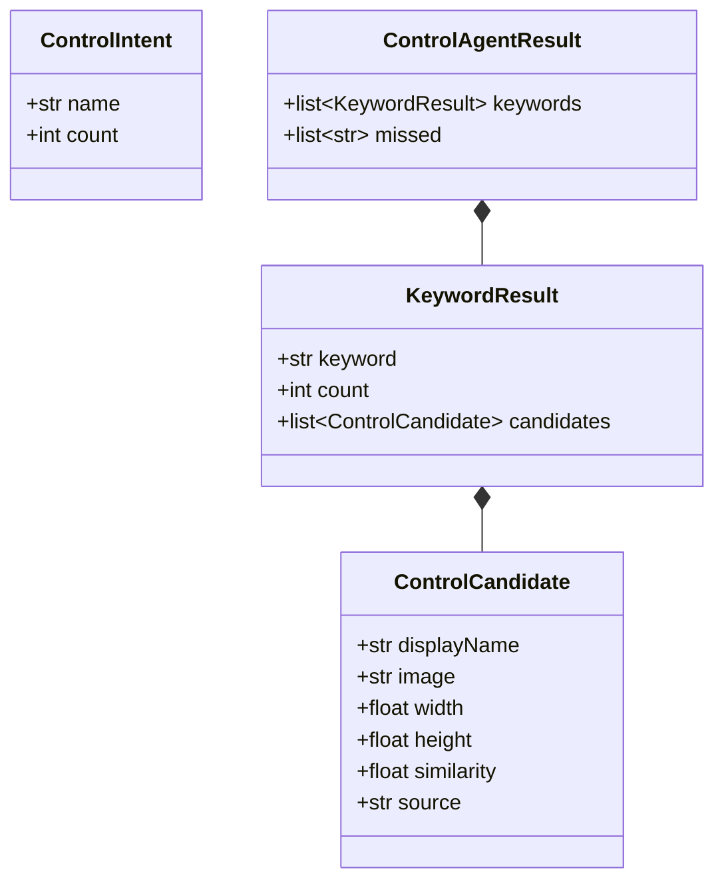
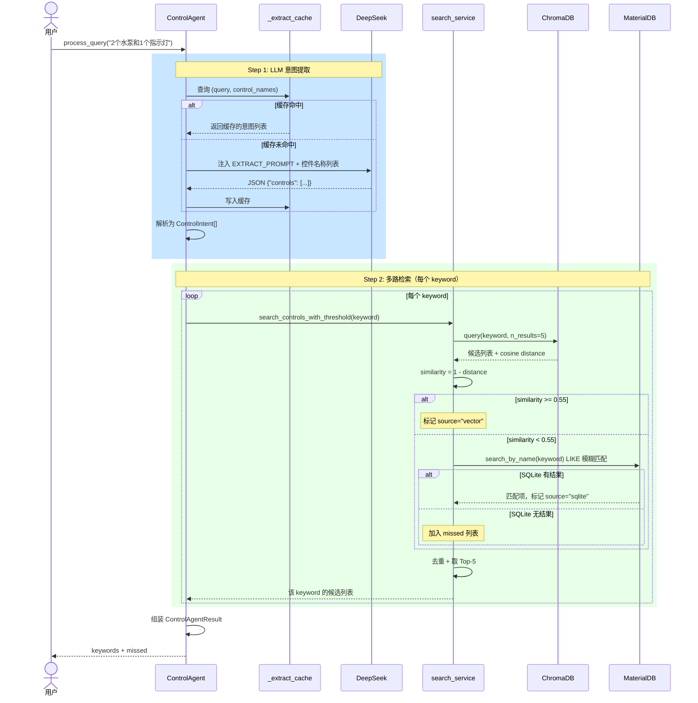
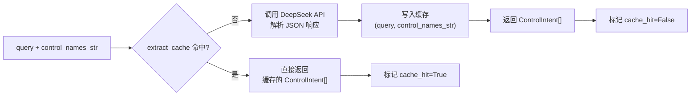
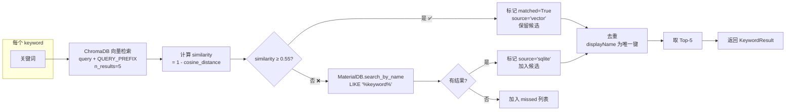
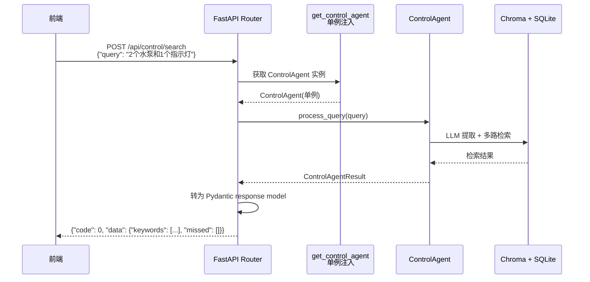
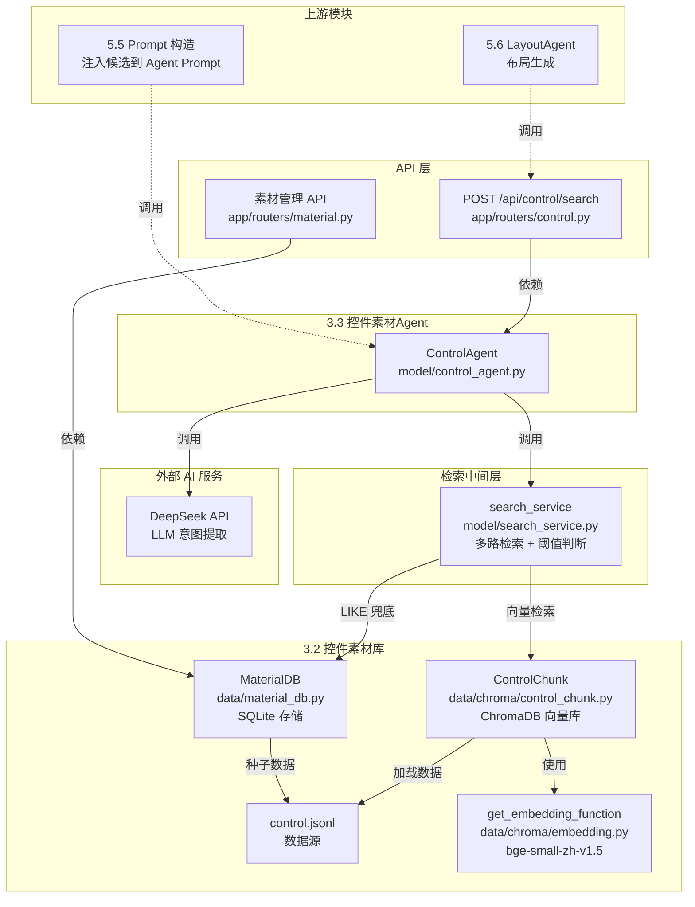

# 3.3 控件素材 Agent

## 3.3.1 概述

控件素材 Agent 是系统的智能检索中间层，接收用户自然语言查询，经过 LLM 意图提取和多路检索后，返回结构化控件候选列表，为上游布局生成和 Prompt 构造提供素材选型依据。

**核心职责：** 将模糊的自然语言描述转化为精确的控件关键词 + 数量意图，再从控件素材库中检索出最匹配的候选项。

**输入输出：**

| 项目 | 内容 |
|------|------|
| 输入 | 用户自然语言查询，如 "2 个水泵和 1 个指示灯" |
| 输出 | `ControlAgentResult`：结构化关键词列表（含候选项） + 未命中列表 |

---

## 3.3.2 核心数据模型

**实现位置：** `model/control_agent.py:53-80`



### ControlIntent

LLM 从用户查询中提取的结构化意图。

| 字段 | 类型 | 说明 |
|------|------|------|
| `name` | str | 控件关键词，优先从控件库 displayName 列表中选取 |
| `count` | int | 所需数量，用户未指定时默认为 1 |

### ControlCandidate

单个检索命中的控件候选项。

| 字段 | 类型 | 说明 |
|------|------|------|
| `displayName` | str | 控件显示名称 |
| `image` | str | 资源路径，如 `symbols/_public/devices/水泵.json` |
| `width` | float | 控件宽度 |
| `height` | float | 控件高度 |
| `similarity` | float | 与关键词的相似度分值（0~1），SQLite 兜底时为 0.0 |
| `source` | str | 检索来源：`"vector"` 或 `"sqlite"` |

### KeywordResult

每个关键词的完整检索结果。

| 字段 | 类型 | 说明 |
|------|------|------|
| `keyword` | str | 检索关键词（即 LLM 提取的意图 name） |
| `count` | int | 用户期望的数量 |
| `candidates` | list[ControlCandidate] | 命中的候选项列表，上限 5 个，已去重 |

### ControlAgentResult

Agent 最终返回结果。

| 字段 | 类型 | 说明 |
|------|------|------|
| `keywords` | list[KeywordResult] | 每个关键词的检索结果 |
| `missed` | list[str] | 完全未命中的关键词列表（向量检索 + SQLite 均无结果） |

---

## 3.3.3 核心流程

**实现位置：** `model/control_agent.py:89-169`



### 流程说明

1. **Step 1 — LLM 意图提取**：将用户自然语言解析为 `ControlIntent[]`（关键词 + 数量），带缓存，相同 query + 控件库不重复调用 LLM
2. **Step 2 — 多路检索**：对每个 keyword 执行向量检索优先，低于阈值则降级到 SQLite LIKE 模糊匹配，全未命中则记入 missed
3. **结果组装**：去重、截断 Top-5，返回 `ControlAgentResult`

---

## 3.3.4 LLM 意图提取

**实现位置：** `model/control_agent.py:171-192`

### Prompt 模板

```text
你是工业SCADA控件检索专家。从用户的自然语言描述中提取所需的控件关键词及数量。

控件库中可用的控件名称列表：
{control_names}

提取要求：
1. 从用户描述中提取控件关键词，关键词必须优先从上方列表中选取
2. 若用户描述的控件不在列表中，提取最接近的关键词用于模糊检索
3. 若用户未指定数量则默认为1

输出JSON：
{"controls": [{"name": "关键词", "count": 数量}]}
```

### 调用参数

| 参数 | 值 | 说明 |
|------|-----|------|
| `model` | `DEEPSEEK_MODEL`（环境变量） | 使用的 LLM 模型 |
| `response_format` | `{"type": "json_object"}` | 强制 JSON 结构化输出 |
| `reasoning_effort` | `"low"` | 意图提取任务较简单，低推理成本 |
| `extra_body` | `{"thinking": {"type": "enabled"}}` | 启用深度思考 |
| `temperature` | 默认 | 无特殊调整 |

### 缓存机制



**缓存 key**：`(query, control_names_str)` — 元组形式，相同查询文本 + 相同控件库内容命中缓存。

**缓存作用域**：进程内内存字典，进程重启后失效。适用于同一会话中重复查询（如用户刷新页面）。

### 示例对照

| 用户输入 | LLM 输出 |
|---------|---------|
| 2个指示灯和1个水泵 | `{"controls": [{"name": "指示灯", "count": 2}, {"name": "水泵", "count": 1}]}` |
| 组态画面需要显示温度和压力 | `{"controls": [{"name": "仪表盘", "count": 1}, {"name": "参数值", "count": 2}]}` |
| 一个水泵 | `{"controls": [{"name": "水泵", "count": 1}]}` |

---

## 3.3.5 多路检索

**实现位置：** `model/search_service.py:6-29`

### 检索流程



### 相似度阈值策略

| 相似度范围 | 检索来源 | 判定 | 后续逻辑 |
|-----------|---------|------|---------|
| ≥ 0.55 | vector | ✅ 命中 | 直接保留在候选列表 |
| < 0.55 | vector → sqlite | ⚠️ 兜底 | 降级到 SQLite LIKE 模糊查询 |
| 无结果 | — | ❌ 未命中 | 关键词加入 `missed` 列表 |

### 去重逻辑

以 `displayName` 为唯一键，相同 `displayName` 的候选项只保留第一个。SQLite 兜底的结果可能与向量检索结果重叠，去重后避免重复。

### 检索结果示例

```
用户输入: "水泵运行状态"

Step 1 LLM 提取:
  → [{name: "水泵", count: 1}, {name: "指示灯", count: 1}]

Step 2 多路检索:
  keyword="水泵":
    Chroma: 水泵       sim=0.89 → ✅ matched, source=vector
    Chroma: 水池       sim=0.45 → ❌ < 0.55 → SQLite 兜底
      SQLite: 无结果
  keyword="指示灯":
    Chroma: 指示灯     sim=0.92 → ✅ matched, source=vector
    Chroma: 运行状态灯 sim=0.78 → ✅ matched, source=vector

返回:
  keywords:
    - {keyword: "水泵", count: 1, candidates: [{水泵, sim=0.89, source=vector}]}
    - {keyword: "指示灯", count: 1, candidates: [{指示灯, sim=0.92}, {运行状态灯, sim=0.78}]}
  missed: []
```

---

## 3.3.6 相似度评分说明

### 向量相似度计算

使用 ChromaDB 的 `cosine` 距离度量，计算公式：

```
similarity = 1 - cosine_distance(query_embedding, doc_embedding)
```

### Embedding 模型

**实现位置：** `data/chroma/embedding.py:4`

- 模型：`model/bge-small-zh-v1.5`
- 加载方式：`SentenceTransformerEmbeddingFunction` 单例模式
- 查询前缀：`为这个句子生成表示以用于检索相关文章：{query_text}`
- 文档模板：`SCADA 控件：{displayName}，宽度 {width}，高度 {height}，资源路径 {image}`

### 阈值 0.55 的依据

| 因素 | 说明 |
|------|------|
| 控件库规模 | 当前 166 条，名称多样性有限 |
| 语义跨度 | 中文工业控件名称语义差异大（如"水泵" vs "指示灯"），0.55 能有效分离 |
| 兜底机制 | SQLite LIKE 作为第二道保障，允许阈值设高，减少误召回 |
| 调优方式 | 可依据线上检索准确率统计进行微调 |

---

## 3.3.7 API 接口

### 检索接口

**`POST /api/control/search`**

**实现位置：** `app/routers/control.py:15-41`



**请求：**

```json
{
  "query": "2个指示灯和1个水泵"
}
```

**响应：**

```json
{
  "code": 0,
  "data": {
    "keywords": [
      {
        "keyword": "指示灯",
        "count": 2,
        "candidates": [
          {
            "displayName": "指示灯",
            "image": "symbols/test/wangj/指示灯.json",
            "width": 30,
            "height": 30,
            "similarity": 0.92,
            "source": "vector"
          }
        ]
      },
      {
        "keyword": "水泵",
        "count": 1,
        "candidates": [
          {
            "displayName": "水泵",
            "image": "symbols/demo/water treatment/水泵.json",
            "width": 131,
            "height": 116,
            "similarity": 0.89,
            "source": "vector"
          }
        ]
      }
    ],
    "missed": []
  }
}
```

### 素材管理接口

**实现位置：** `app/routers/material.py:9-58`

| 接口 | 方法 | 说明 | 对应方法 |
|------|------|------|---------|
| `/api/material/list` | GET | 返回全部素材列表 | `MaterialDB.list_all()` |
| `/api/material/query-results` | GET | 查询检索历史记录 | `MaterialDB.list_query_results()` |
| `/api/material/query-results` | POST | 保存一次查询结果 | `MaterialDB.save_query_result()` |
| `/api/material/query-results` | DELETE | 清空所有查询记录 | `MaterialDB.clear_query_results()` |

### Agent 单例注入

**实现位置：** `app/deps.py`

```python
def get_control_agent():
    agent = ControlAgent()
    return agent
```

ControlAgent 是无状态设计（每次 `process_query` 独立），但内部持有了 MaterialDB 连接和 Chroma 客户端，适合作为单例复用。

---

## 3.3.8 模块依赖关系



### 依赖关系说明

| 依赖方 | 被依赖方 | 关系 |
|--------|---------|------|
| `ControlAgent` | `search_service` | 调用多路检索函数 |
| `ControlAgent` | DeepSeek API | 调用 LLM 进行意图提取 |
| `search_service` | `ControlChunk`（ChromaDB） | 执行向量检索 |
| `search_service` | `MaterialDB`（SQLite） | 执行 LIKE 兜底 |
| `ControlChunk` | `get_embedding_function` | 使用 embedding 模型 |
| `ControlChunk` / `MaterialDB` | `control.jsonl` | 加载控件数据源 |
| `app/routers/control.py` | `ControlAgent` | 依赖注入，对外暴露检索 API |
| `app/routers/material.py` | `MaterialDB` | 依赖注入，素材管理接口 |

---

## 3.3.9 环境变量与配置

### 环境变量

**使用位置：** `model/control_agent.py:46-50`

| 变量 | 用途 | 必填 | 默认值 |
|------|------|------|--------|
| `DEEPSEEK_API_KEY` | DeepSeek API 密钥 | ✅ | — |
| `DEEPSEEK_BASE_URL` | API 地址 | ❌ | `https://api.deepseek.com` |
| `DEEPSEEK_MODEL` | 模型名称 | ✅ | — |

### 路径配置

**定义位置：** `app/config.py` 的 `Settings` 类

| 配置项 | 默认值 | 说明 |
|--------|--------|------|
| `control_jsonl_path` | `data/control.jsonl` | 控件数据源路径 |
| `db_path` | `data/material.db` | SQLite 数据库路径 |
| `chroma_dir` | `data/chroma/db` | ChromaDB 持久化目录 |

### OpenAPI 超时

```python
_client = OpenAI(
    api_key=os.environ.get("DEEPSEEK_API_KEY"),
    base_url=os.environ.get("DEEPSEEK_BASE_URL", "https://api.deepseek.com"),
    timeout=50.0,
)
```

LLM 调用超时设为 50 秒，兼顾网络波动和模型推理时间。

---

## 3.3.10 与 PRD 差距分析

| 功能 | PRD 要求 | 当前状态 | 说明 |
|------|---------|---------|------|
| 关键词 + 数量提取 | 从自然语言提取结构化意图 | ✅ 已实现 | LLM 意图提取，带缓存 |
| 向量检索 | ChromaDB cosine 检索 | ✅ 已实现 | threshold=0.55 |
| SQLite 兜底 | 向量检索无命中时执行 | ✅ 已实现 | LIKE 模糊匹配 |
| 去重 + Top-5 | 返回去重后的 Top 候选 | ✅ 已实现 | displayName 唯一去重 |
| Query 改写与实体提取 | 提取 device_type/state/style | ❌ 未实现 | 前端 AssetQueryResult 类型已预留 |
| 相似度 >0.85 直接复用 | 高相似度直接跳过后续流程 | ❌ 未实现 | 当前不区分高相似度策略 |
| 相似度 <0.70 调用文生图 | 低相似度时生成新素材 | ❌ 未实现 | 需要集成文生图 API |
| 多轮对话上下文 | 支持追问、修正历史查询 | ❌ 未实现 | 当前为单次无状态查询 |
| 素材自动质检 | 尺寸 ≥128×128，格式/风格校验 | ❌ 未实现 | 素材库侧功能 |

---

## 3.3.11 日志规范

**实现位置：** `model/control_agent.py:90-168`

Agent 各阶段输出统一日志格式，便于调试和监控：

| 日志事件 | 内容 | 级别 |
|---------|------|------|
| 意图提取 | `🤖 LLM提取: 指示灯x2, 水泵x1 (缓存命中)` | INFO |
| 向量命中 | `🔎 向量检索 "水泵": ✅ 水泵, 给水泵` | INFO |
| 向量未命中 | `🔎 向量检索 "水泵": ❌ 无命中 (sim < 0.55)` | INFO |
| SQLite 命中 | `💾 SQLite兜底 "水泵": ✅ 水泵` | INFO |
| SQLite 未命中 | `💾 SQLite兜底 "水泵": ❌ 无结果` | INFO |
| 最终汇总 | `✅ 返回 2 个关键词, 3 个候选项` | INFO |
| 未命中 | `❌ 未命中: 变压器` | INFO |

---
config:
  layout: dagre
  themeVariables:
    fontSize: 20px
    rankSpacing: 60
    nodeBorder: 2px
---
flowchart TB
    INTENT["LLM 意图提取"] --> CACHE{"`**缓存命中？**`"}
    CACHE -- 是 --> SEARCH["`**多路检索**`"]
    CACHE -- 否 --> LLM["`**调用大模型**`"]
    LLM --> SEARCH
    SEARCH --> THRESHOLD{"相似度达标？"}
    THRESHOLD -- 是 --> CAND["加入候选"]
    THRESHOLD -- 否 --> SQLITE["数据库兜底"]
    SQLITE --> HAS{"有结果？"}
    HAS -- 是 --> CAND
    HAS -- 否 --> MISS["文生图 API"]
    CAND --> RESULT(["检索结果"])
    MISS --> RESULT

     INTENT:::process
     CACHE:::decision
     SEARCH:::process
     LLM:::llm
     THRESHOLD:::decision
     CAND:::process
     HAS:::decision
     MISS:::error
     RESULT:::agent
    classDef agent fill:#ede7f6,stroke:#5e35b1,stroke-width:2px,color:#000,font-size:16px,font-weight:bold
    classDef process fill:#e3f2fd,stroke:#1e88e5,stroke-width:2px,color:#000,font-size:16px,font-weight:bold
    classDef decision fill:#fff3e0,stroke:#fb8c00,stroke-width:2px,color:#000,font-size:16px,font-weight:bold
    classDef error fill:#fff8e1,stroke:#f9a825,stroke-width:2px,color:#000,font-size:16px,font-weight:bold
    classDef llm fill:#f3e5f5,stroke:#8e24aa,stroke-width:2px,color:#000,font-size:16px,font-weight:bold

---

## 3.3.12 性能设计说明

### 后端性能（≤500ms、跨平台）

| 场景 | 耗时链路 | 预算 |
|------|---------|------|
| 缓存命中 | 跳过 LLM 调用，直接执行 Chroma 向量检索 + SQLite 兜底 + 去重 | ≤300ms |
| 缓存未命中（不含 LLM） | LLM 意图提取完成后，Chroma 检索 + SQLite 兜底 + 去重 | ≤300ms |
| 全链路含 LLM | LLM 意图提取（排除在 500ms 外）+ 多路检索 | LLM 部分不占预算，检索 ≤300ms |
| 跨平台 | `ControlAgent` 纯 Python 实现，仅依赖 `openai` SDK + ChromaDB 客户端 | Windows/Linux 均可用 |

**缓存机制**：`_extract_cache` 以 `(query, control_names_str)` 为 key 做进程内缓存，相同查询+控件库不重复调用 LLM，大幅降低平均响应时间。

### 第三方依赖

| 依赖项 | 调用参数 | 降级策略 |
|-------|---------|---------|
| DeepSeek API | `response_format=json_object`，`reasoning_effort=low`，超时 50s | API 不可用→意图提取失败→关键词原样传入检索，全部标记为 `missed`，不阻塞主流程 |
| `bge-small-zh-v1.5`（复用 3.2） | 本地部署，无网络依赖 | 离线 Embedding，零故障率 |

**故障率保障**：
- LLM API 单次失败重试 1 次
- API 连续失败 → 关键词直接进入多路检索（原词作为 keyword），不阻塞返回
- 故障率统计：日志记录每次 LLM 调用耗时/状态，通过 `model/control_agent.py` 的 `🤖 LLM提取` / `❌ 未命中` 日志标签汇总统计
- DeepSeek API 通过环境变量 `DEEPSEEK_BASE_URL` 支持切换兼容端点（如需切换到其他 OpenAI 兼容接口）