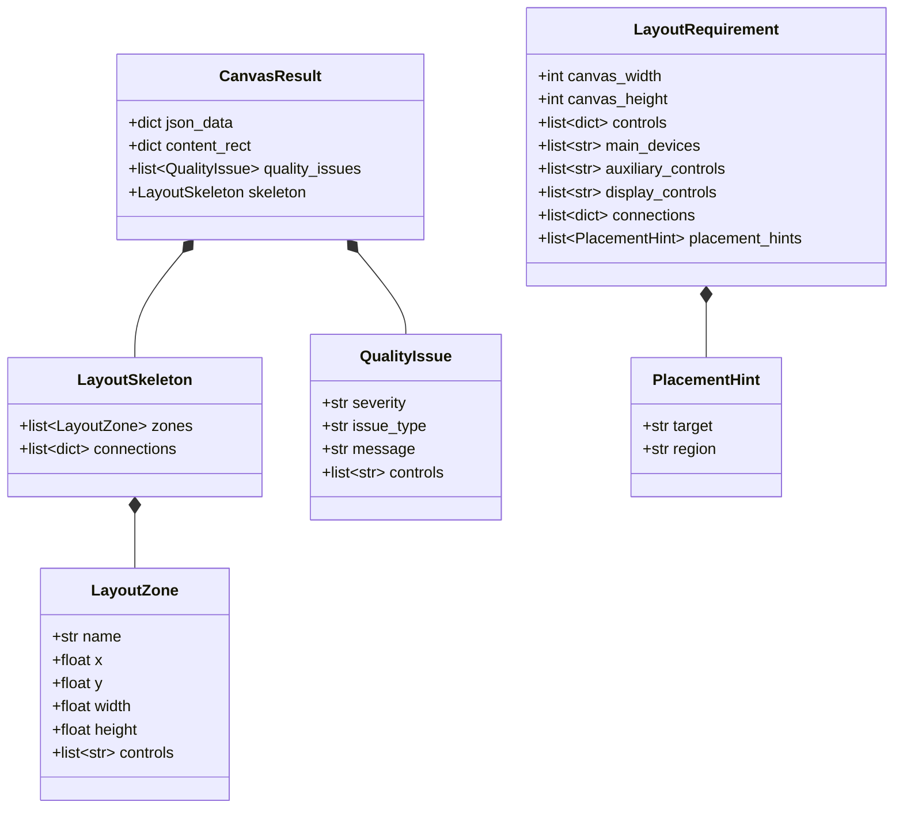

# 3.4 自动布局 Agent

## 3.4.1 概述

自动布局 Agent 是画布布局编排引擎，接收用户自然语言查询和控件候选列表，经过 LLM 意图解析、区域划分、坐标计算、LLM 微调与质量检测后，输出符合 SCADA 组态规范的画布 JSON。

**核心职责：** 将用户模糊的布局描述转化为精确的控件区域分配与坐标定位，生成可直接渲染的画布数据。

**输入输出：**

| 项目 | 内容 |
|------|------|
| 输入 | 用户自然语言查询 + 控件列表（displayName/image/width/height） + 画布尺寸 |
| 输出 | `CanvasResult`：画布 JSON 数据 + contentRect + 质量问题列表 + 布局骨架 |

---

## 3.4.2 核心数据模型

**实现位置：** `model/canva_agent.py:132-186`



### LayoutRequirement

LLM + 启发式规则提取的完整布局需求。

| 字段 | 类型 | 说明 |
|------|------|------|
| `canvas_width` | int | 画布宽度 |
| `canvas_height` | int | 画布高度 |
| `controls` | list[dict] | 完整控件列表（含 displayName/image/width/height） |
| `main_devices` | list[str] | 主设备/核心被控对象名称列表 |
| `auxiliary_controls` | list[str] | 控制类控件名称列表（按钮、开关、启停等） |
| `display_controls` | list[str] | 显示类控件名称列表（仪表、参数值、指示灯等） |
| `connections` | list[dict] | 连接关系列表 `{from, to, relation}` |
| `placement_hints` | list[PlacementHint] | 用户明确表达的位置意图 |

### LayoutZone

布局区域，代表画布上的一个矩形分区。

| 字段 | 类型 | 说明 |
|------|------|------|
| `name` | str | 区域名称：`device_zone` / `control_zone` / `display_zone` |
| `x` | float | 区域左上角 x 坐标 |
| `y` | float | 区域左上角 y 坐标 |
| `width` | float | 区域宽度 |
| `height` | float | 区域高度 |
| `controls` | list[str] | 归属于该区域的控件名称列表 |

### LayoutSkeleton

布局骨架，由多个 LayoutZone 和连接关系组成。

| 字段 | 类型 | 说明 |
|------|------|------|
| `zones` | list[LayoutZone] | 所有布局区域 |
| `connections` | list[dict] | 控件之间的连接关系 |

### QualityIssue

质量检测发现的问题。

| 字段 | 类型 | 说明 |
|------|------|------|
| `severity` | str | 严重程度：`error` / `warning` |
| `issue_type` | str | 问题类型：`overlap` / `overflow` / `isolated` / `schema` |
| `message` | str | 问题描述 |
| `controls` | list[str] | 涉及的相关控件名称 |

### CanvasResult

Agent 最终返回结果。

| 字段 | 类型 | 说明 |
|------|------|------|
| `json_data` | dict | 符合 HT for Web 规范的画布 JSON |
| `content_rect` | dict | 内容包围盒 `{x, y, width, height}` |
| `quality_issues` | list[QualityIssue] | 质量检测问题列表 |
| `skeleton` | LayoutSkeleton | 布局骨架信息 |

---

## 3.4.3 核心流程

**实现位置：** `model/canva_agent.py:1004-1111`

自动布局分为 6 个步骤：

1. **Step 1 — 布局需求提取**：将用户自然语言 + 控件列表传入 LLM，提取出主设备、控制类控件、显示类控件的分类、连接关系以及用户明确的位置意图。若 LLM 调用失败或无配置，则降级为启发式规则分类（控件名称关键词匹配 + 尺寸阈值）。
2. **Step 2 — 布局骨架生成**：根据控件分类和位置意图，将控件分配到三个区域（device_zone / control_zone / display_zone），并根据画布尺寸计算每个区域的坐标和大小。
3. **Step 3 — 坐标计算**：根据控件总数选择布局策略——控件数 ≤ 20 时采用区域内逐行排列（zonal layout）；> 20 时采用力导向布局（弹簧-斥力物理模拟）。最后按画布尺寸缩放并对边缘做约束。
4. **Step 4 — LLM 布局微调**（可选）：将初步布局结果送入 LLM 进行坐标微调，LLM 只能调整 x/y 坐标，不可增删或修改节点属性。失败时保留规则布局结果。
5. **Step 5 — 质量检测**：检测控件重叠（面积占比 >10%）、画布溢出、孤立控件三类问题。
6. **Step 6 — JSON 组装与 Schema 校验**：将坐标结果组装为 HT for Web 画布 JSON，进行 JSON Schema 校验，返回 `CanvasResult`。

---

## 3.4.4 布局需求提取

**实现位置：** `model/canva_agent.py:27-59, 321-351`

### LLM Prompt 模板

```text
SCADA 组态语义分析器。根据用户描述，从给定控件列表中识别控件、连接关系和布局意图。

可用控件列表：
{controls_info}

要求：
1. 只能使用控件列表中的 displayName,不得编造名称。
2. main_devices:主设备/核心被控对象。
3. auxiliary_controls:控制类控件，如按钮、开关、启停、急停、控制器。
4. display_controls:显示类控件，如仪表、参数值、指示灯、图表、趋势图。
5. connections 表示控制或显示关系：
   - 控制类控件 -> 主设备,relation="控制"
   - 显示类控件 -> 主设备,relation="显示"
6. placement_hints 表示明确的布局意图，只能使用这些 region 枚举：
   - left, right, top, bottom, center
   - left_top, right_top, left_bottom, right_bottom
7. 只有当用户明确表达了位置意图时才输出 placement_hints。
8. 不确定的连接不要输出。

只输出 JSON,不要解释:
{
  "main_devices": [],
  "auxiliary_controls": [],
  "display_controls": [],
  "connections": [
    {{"from": "", "to": "", "relation": "控制"}}
  ],
  "placement_hints": [
    {{"target": "", "region": "left"}}
  ]
}
```

### 调用参数

| 参数 | 值 | 说明 |
|------|-----|------|
| `model` | `DEEPSEEK_MODEL`（环境变量） | 使用的 LLM 模型 |
| `response_format` | `{"type": "json_object"}` | 强制 JSON 结构化输出 |
| `reasoning_effort` | `"low"` | 布局分类任务较简单，低推理成本 |
| `extra_body` | `{"thinking": {"type": "enabled"}}` | 启用深度思考 |

### 启发式兜底分类

当 LLM 不可用或解析失败时，使用 `_classify_controls` 基于名称关键词的规则分类：

| 分类依据 | 归属 | 判定条件 |
|---------|------|---------|
| 包含"按钮""开关""控制""启动""急停""下行控制" | 控制类（auxiliary） | 名称关键词匹配 `CONTROL_KEYWORDS` |
| 包含"参数值""仪表""指示灯""图表""图""表" | 显示类（display） | 名称关键词匹配 `DISPLAY_KEYWORDS` |
| 宽或高 ≥ 200px | 主设备（main_device） | `LARGE_DEVICE_SIZE` 阈值 |
| 其他 | 控制类（auxiliary） | 默认归类为控制类 |

### 位置意图提取

用户文本中的位置意图通过两阶段获取：

1. **LLM 提取**：若 LLM 返回 `placement_hints`，经 `_sanitize_placement_hints` 校验（target 必须在控件列表中，region 必须为合法值）后使用。
2. **文本规则兜底**：若 LLM 未提取位置意图，使用 `_extract_placement_hints_from_query` 在用户查询中通过 `REGION_SYNONYMS` 匹配位置关键词：

| 中文关键词 | region 枚举值 |
|-----------|--------------|
| 左、左侧、左面、靠左 | `left` |
| 右、右侧、右面、靠右 | `right` |
| 上、上方、顶部 | `top` |
| 下、下方、底部 | `bottom` |
| 中间、居中 | `center` |
| 左上、左上角 | `left_top` |
| 右上、右上角 | `right_top` |
| 左下、左下角 | `left_bottom` |
| 右下、右下角 | `right_bottom` |

### 示例对照

| 用户输入 | LLM 提取结果 |
|---------|-------------|
| 左侧一个水泵，右侧两个按钮和指示灯 | `{"main_devices":["水泵"], "auxiliary_controls":["按钮"], "display_controls":["指示灯"], "placement_hints":[{"target":"水泵","region":"left"},{"target":"按钮","region":"right"}]}` |
| 一个水泵配启停控制和运行状态显示 | `{"main_devices":["水泵"], "auxiliary_controls":["启停控制"], "display_controls":["运行状态灯"], "connections":[{"from":"启停控制","to":"水泵","relation":"控制"},{"from":"运行状态灯","to":"水泵","relation":"显示"}]}` |

---

## 3.4.5 坐标计算

**实现位置：** `model/canva_agent.py:487-674`

坐标计算根据控件数量选择两种策略，并在最终统一进行画布缩放与边缘约束。

### Zonal 布局（≤20 个控件）

**实现位置：** `model/canva_agent.py:499-531`

将画布划分为三个区域，每个区域内控件按垂直方向逐行排列。

**区域划分规则：**

| 区域 | 位置 | 宽度 | 高度 | 用途 |
|------|------|------|------|------|
| `device_zone` | 左侧（距左边界 gap=40） | max(画布宽×40%, 最宽设备+gap×2) | max(画布高×50%, 所有设备总高+gap×2) | 主设备居中排列，padding=30 |
| `control_zone` | 右上（device_zone 右侧） | 剩余宽度，至少为画布宽×22% | 至少为画布高×35% | 控制类控件垂直排列，padding=20 |
| `display_zone` | 右下（control_zone 下方） | 与 control_zone 同宽 | 剩余高度，至少为画布高×35% | 显示类控件垂直排列，padding=20 |

padding 值分别为 device_zone 30px、control_zone 20px、display_zone 20px。

### 力导向布局（>20 个控件）

**实现位置：** `model/canva_agent.py:570-674`

当控件数量超过 20 时，采用基于物理模拟的力导向布局算法：

- **斥力**：所有节点之间互相排斥，力大小与距离平方成反比（库仑斥力模型），`repulsion_k = 5000.0`
- **弹簧引力**：存在连接关系的节点之间相互吸引，符合胡克定律，`spring_k = 0.01`
- **区域吸引力**：每个节点向其所属的区域中心吸引，`zone_attract_k = 0.02`
- **阻尼系数**：每次迭代速度衰减 `0.9`，保证收敛
- **迭代次数**：100 轮迭代

### 画布缩放与边缘约束

**实现位置：** `model/canva_agent.py:534-568`

坐标计算完成后统一执行两步后处理：

1. **`_scale_to_canvas`**：计算所有节点的内容包围盒，根据画布尺寸等比缩放（最大缩放倍数 2.0 倍），将布局居中适应画布。
2. **`_clamp_nodes_to_canvas`**：将每个节点的 x/y 约束在画布边界内，确保不出界。

---

## 3.4.6 LLM 布局微调

**实现位置：** `model/canva_agent.py:677-735`

规则布局完成后，可选的 LLM 微调步骤通过 `_refine_layout_with_llm` 执行，用于优化坐标排布，减少重叠。

### Prompt 模板

```text
SCADA 画布布局微调器。你只能调整节点的 x 和 y 坐标。

画布尺寸：
width={canvas_width}, height={canvas_height}

输入节点 JSON:
{layout_json}

硬性约束：
1. 不得新增、删除、重命名节点。
2. 不得修改 displayName、image、width、height。
3. 所有节点必须完整位于画布内。
4. 尽量避免重叠。
5. 控制类控件靠右上，显示类控件靠右下，主设备靠左中。
6. x、y 必须是整数。

只输出 JSON,不要解释:
{"nodes":[{"displayName":"","image":"","width":0,"height":0,"x":0,"y":0}]}
```

### 合并逻辑

`_merge_refined_nodes` 将 LLM 返回的微调结果与原始布局合并：以 `displayName` 为键匹配，仅替换 x/y 坐标，保留所有其他原始属性。微调失败的节点保持原坐标不变，最后统一执行边缘约束。

### 容错

LLM 调用失败（网络异常、格式错误等）时直接返回原始规则布局结果，不会阻塞整体流程。

---

## 3.4.7 质量检测

**实现位置：** `model/canva_agent.py:763-848`

`_quality_check` 在布局完成后检测三类问题：

### 重叠检测

两两检查控件之间的重叠面积占比（重叠面积 / 较小控件的面积），阈值 10%：

```
overlap_ratio = overlap_area / min(area1, area2)
```

| 条件 | 结果 |
|------|------|
| overlap_ratio > 10% | `[warning] overlap`：报告重叠率 |

### 画布溢出检测

检查每个控件的四个边界是否超出画布范围：

| 条件 | 结果 |
|------|------|
| x_min < 0 或 x_max > canvas_w | `[error] overflow`：报告水平超界 |
| y_min < 0 或 y_max > canvas_h | `[error] overflow`：报告垂直超界 |

### 孤立控件检测

检查除显示类控件外，其他控件是否至少参与了一条连接关系：

| 条件 | 结果 |
|------|------|
| 非显示类控件且无连接关系 | `[warning] isolated`：报告为孤立控件 |

---

## 总流程图

```mermaid
---
config:
  layout: dagre
  themeVariables:
    fontSize: 20px
    rankSpacing: 60
    nodeBorder: 2px
---
flowchart TB
    INPUT["用户输入、控件列表、画布尺寸"] --> EXTRACT["布局需求提取"]
    EXTRACT --> SKELETON["生成布局骨架"]

    SKELETON --> COORD{"控件数量"}

    COORD -->|"≤20"| ZONAL["Zonal 布局"]
    COORD -->|">20"| FORCE["力导向布局"]

    ZONAL --> SCALE["画布缩放 + 边缘约束"]
    FORCE --> SCALE

    SCALE --> REFINE{"LLM 可用?"}
    REFINE -->|"是"| LLM_REFINE["LLM 微调坐标"]
    REFINE -->|"否"| QUALITY["质量检测"]
    LLM_REFINE --> QUALITY

    QUALITY --> ASSEMBLE["JSON 组装 + Schema 校验"]

    ASSEMBLE --> OUTPUT["CanvasResult\n画布 JSON"]

    EXTRACT:::process
    SKELETON:::process
    COORD:::decision
    ZONAL:::process
    FORCE:::process
    SCALE:::process
    REFINE:::decision
    LLM_REFINE:::process
    QUALITY:::process
    ASSEMBLE:::process

    classDef process fill:#e3f2fd,stroke:#1e88e5,stroke-width:2px,color:#000,font-size:16px,font-weight:bold
    classDef decision fill:#fff3e0,stroke:#fb8c00,stroke-width:2px,color:#000,font-size:16px,font-weight:bold
    classDef agent fill:#ede7f6,stroke:#5e35b1,stroke-width:2px,color:#000,font-size:16px,font-weight:bold
    classDef process fill:#e3f2fd,stroke:#1e88e5,stroke-width:2px,color:#000,font-size:16px,font-weight:bold
    classDef decision fill:#fff3e0,stroke:#fb8c00,stroke-width:2px,color:#000,font-size:16px,font-weight:bold
    classDef error fill:#fff8e1,stroke:#f9a825,stroke-width:2px,color:#000,font-size:16px,font-weight:bold
    classDef llm fill:#f3e5f5,stroke:#8e24aa,stroke-width:2px,color:#000,font-size:16px,font-weight:bold

---

## 3.4.8 性能设计说明

### 后端性能（≤500ms、跨平台）

| 布局策略 | 触发条件 | 复杂度 | 耗时预算 |
|---------|---------|--------|---------|
| Zonal 布局 | 控件数 ≤20 | O(n) 逐行排列 | ≤100ms |
| 力导向布局 | 控件数 >20 | O(n²×100) 迭代 | ≤400ms |
| 画布缩放+边缘约束 | 所有场景 | O(n) | ≤20ms |
| 质量检测（重叠+溢出+孤立） | 所有场景 | O(n²) 两两检测 | ≤50ms |
| **全链路不含 LLM** | — | — | **≤500ms** |

**分支策略**：≤20 个控件时走 Zonal 快速路径（O(n)，≤100ms），>20 个控件时才触发力导向布局（压缩在 400ms 内通过 100 轮迭代+阻尼 0.9 保证收敛）。

**LLM 排除项**：Step 1 布局需求提取与 Step 4 LLM 坐标微调为 LLM 调用，排除在 500ms 预算外。

**跨平台**：纯 Python 数值计算，无 GPU/系统原生库依赖。

### 第三方依赖

| 依赖项 | 调用参数 | 降级策略 |
|-------|---------|---------|
| DeepSeek API（意图提取） | `response_format=json_object`，`reasoning_effort=low`，超时 50s | LLM 不可用→降级为 `_classify_controls` 启发式规则分类（名称关键词匹配 + 尺寸阈值） |
| DeepSeek API（坐标微调） | `response_format=json_object`，`reasoning_effort=low`，超时 50s | LLM 不可用→跳过微调，直接使用规则布局结果 |

**启发式兜底**：`CONTROL_KEYWORDS` + `DISPLAY_KEYWORDS` + `LARGE_DEVICE_SIZE` 三套规则覆盖，确保 LLM 完全不可用时布局流程不中断。

**故障率保障**：
- LLM 为可选增强步骤（`_extract_layout_requirement` + `_refine_layout_with_llm`），非必须路径
- 任何 LLM 调用失败均降级为规则引擎，不影响最终输出
```
