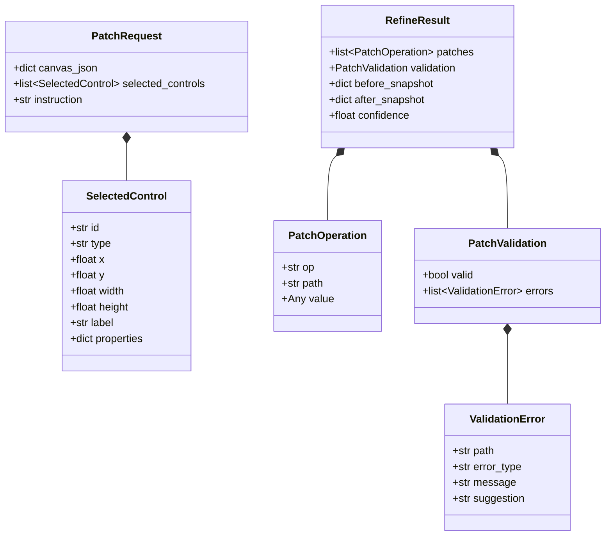
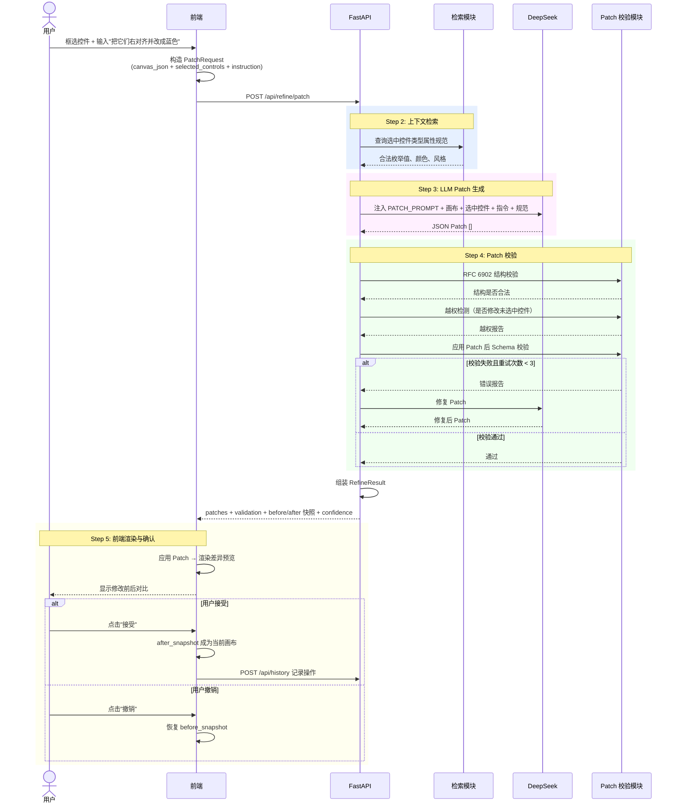
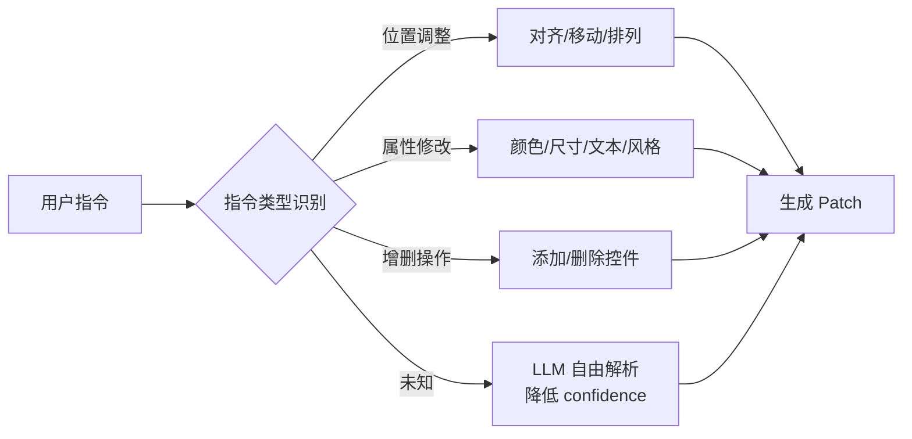
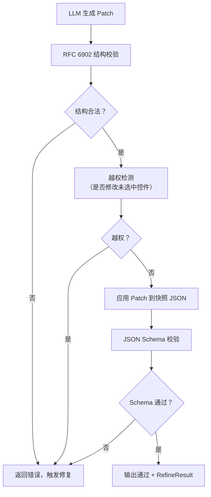
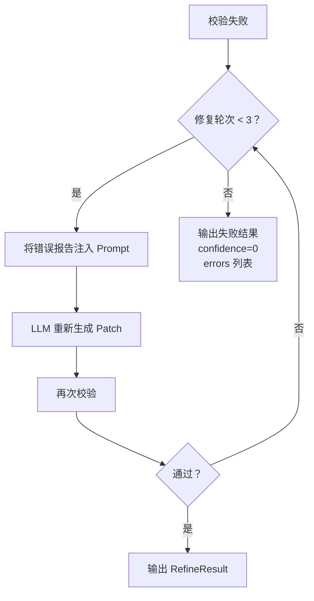
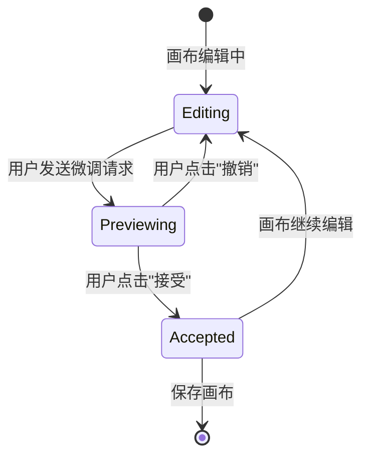
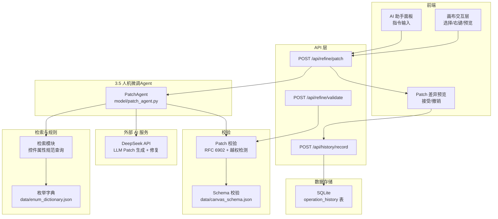

# 3.5 人机微调 Agent

## 3.5.1 概述

人机微调 Agent 是画布布局的人机协同微调引擎，接收用户选中控件和自然语言调整指令，经过 LLM 意图解析和约束校验后，生成符合 RFC 6902 标准的 JSON Patch 差异包，驱动前端完成差异预览、接受和撤销。

**核心职责：** 将用户在画布上的局部调整意图转化为精确的 JSON Patch 操作序列，仅返回差异包，不返回全量 JSON，实现低带宽、高效率的增量修改。

**输入输出：**

| 项目 | 内容 |
|------|------|
| 输入 | 选中控件列表 + 全量画布 JSON + 自然语言调整指令（如"右对齐并改成蓝色"） |
| 输出 | `RefineResult`：JSON Patch 操作序列 + 校验报告 + before/after 快照 + 置信度 |

---

## 3.5.2 核心数据模型



### PatchRequest

前端向后端发送的微调请求。

| 字段 | 类型 | 说明 |
|------|------|------|
| `canvas_json` | dict | 当前画布的完整 JSON（含 canvas / control / binding） |
| `selected_controls` | list[SelectedControl] | 用户在画布上选中的控件列表及其完整属性 |
| `instruction` | str | 用户自然语言调整指令 |

### SelectedControl

单个被选中的控件信息。

| 字段 | 类型 | 说明 |
|------|------|------|
| `id` | str | 控件唯一标识 |
| `type` | str | 控件类型（pump / valve / indicator_light ...） |
| `x` | float | 控件 x 坐标 |
| `y` | float | 控件 y 坐标 |
| `width` | float | 控件宽度 |
| `height` | float | 控件高度 |
| `label` | str | 控件显示标签 |
| `properties` | dict | 控件其他属性（color / status / visibility 等） |

### PatchOperation

单条 RFC 6902 JSON Patch 操作。

| 字段 | 类型 | 说明 |
|------|------|------|
| `op` | str | 操作类型：`replace` / `add` / `remove` / `move` / `copy` / `test` |
| `path` | str | JSON Pointer 路径，如 `/control/3/x` |
| `value` | Any | 操作值（`remove` / `test` 时为可选） |

### PatchValidation

Patch 校验结果。

| 字段 | 类型 | 说明 |
|------|------|------|
| `valid` | bool | 校验是否通过 |
| `errors` | list[ValidationError] | 错误列表 |

### ValidationError

单条校验错误详情。

| 字段 | 类型 | 说明 |
|------|------|------|
| `path` | str | 错误所在 JSON 路径 |
| `error_type` | str | 错误类型：`invalid_op` / `path_not_found` / `enum_out_of_range` / `access_violation` |
| `message` | str | 错误描述 |
| `suggestion` | str | 修复建议 |

### RefineResult

Agent 最终返回结果。

| 字段 | 类型 | 说明 |
|------|------|------|
| `patches` | list[PatchOperation] | 生成的 JSON Patch 操作序列 |
| `validation` | PatchValidation | 校验结果 |
| `before_snapshot` | dict | 应用 Patch 前的画布 JSON 快照 |
| `after_snapshot` | dict | 应用 Patch 后的画布 JSON 快照（前端可直接用于预览） |
| `confidence` | float | 置信度（0~1），低于 0.5 建议用户审慎接受 |

---

## 3.5.3 核心流程

人机微调分为 5 个步骤：

1. **Step 1 — 请求构造**：前端捕获用户选中控件和指令，打包为 `PatchRequest`
2. **Step 2 — 上下文检索**：查询选中控件类型对应的属性规范（合法颜色、风格、枚举值等），作为 LLM Prompt 约束
3. **Step 3 — LLM Patch 生成**：将全量画布 + 选中控件 + 指令 + 属性规范送入 LLM，生成 RFC 6902 JSON Patch
4. **Step 4 — Patch 校验**：RFC 6902 结构校验 → 越权检测 → 应用后 Schema 校验 → 失败则进入修复（最多 3 轮）
5. **Step 5 — 前端渲染与确认**：返回 `RefineResult`，前端渲染差异预览，用户决定接受或撤销



---

## 3.5.4 LLM Patch 生成

### Prompt 模板

```text
你是 DaoSCADA 组态 JSON Patch 生成 Agent。

任务：
根据用户调整指令，对选中的控件生成 RFC 6902 JSON Patch 差异包。

当前画布 JSON：
{canvas_json}

用户选中的控件：
{selected_controls}

用户调整指令：
{instruction}

可用属性规范（仅限合法值）：
- control.color 合法值：{valid_colors}
- control.style 合法值：{valid_styles}
- control.type 合法值：{valid_types}
- 坐标必须为整数

强约束：
1. 只能输出 JSON Patch 数组，不得输出其他文本
2. patch 的 path 必须是 JSON Pointer 格式（如 /control/3/color）
3. 只能修改选中控件的属性，不得修改未选中的控件或画布全局配置
4. 不得删除 binding 中仍被引用的控件，除非同步移除绑定关系
5. op 只能使用：replace / add / remove / move / copy / test
6. replace / remove 的 path 必须已存在于当前画布 JSON 中
7. add 的父路径必须已存在
8. 所有枚举值必须来自上方可用属性规范
9. x、y 必须是整数

输出：
只输出 JSON Patch 数组，不要解释：
[
  {"op": "replace", "path": "/control/3/x", "value": 640},
  {"op": "replace", "path": "/control/3/color", "value": "#0052D9"}
]
```

### 调用参数

| 参数 | 值 | 说明 |
|------|-----|------|
| `model` | `DEEPSEEK_MODEL`（环境变量） | 使用的 LLM 模型 |
| `response_format` | `{"type": "json_object"}` | 强制 JSON 结构化输出 |
| `reasoning_effort` | `"medium"` | Patch 生成涉及坐标计算和约束遵守，中等推理成本 |
| `extra_body` | `{"thinking": {"type": "enabled"}}` | 启用深度思考 |
| `temperature` | 0.3 | 低温度以保证输出稳定 |

### 指令类型与 Patch 映射

| 用户指令 | 生成 Patch 操作 |
|---------|---------------|
| 右对齐 | 将所有选中控件的 x 统一为最右侧控件的 x |
| 改成蓝色 | `replace` path 指向每个选中控件的 color 属性，value 为 `#0052D9` |
| 移动到(800, 400) | `replace` 每个选中控件的 x、y |
| 放大 1.5 倍 | `replace` 每个选中控件的 width、height 乘以 1.5（结果取整） |
| 删除选中控件 | `remove` 选中控件，同时 `remove` 对应的 binding 条目 |
| 在选中控件右侧添加指示灯 | `add` 新控件到 control 数组，x 为右侧控件 x+width+间距 |

### 指令意图分类与兜底



当 LLM 无法确定指令意图时，仍然尝试生成 Patch 但将 `confidence` 设置为 ≤0.5，前端应突出显示低置信度提示。

### 示例对照

| 用户输入 | LLM 生成 Patch |
|---------|---------------|
| 把选中控件右对齐 | `[{"op":"replace","path":"/control/3/x","value":640},{"op":"replace","path":"/control/4/x","value":640}]` |
| 把水泵1改成红色 | `[{"op":"replace","path":"/control/1/color","value":"#D9363E"}]` |
| 删除选中的按钮 | `[{"op":"remove","path":"/control/5"},{"op":"remove","path":"/binding/2"}]` |
| 在按钮旁边加一个指示灯 | `[{"op":"add","path":"/control/-","value":{"id":"indicator_new","type":"indicator_light","x":520,"y":300,"width":30,"height":30,"label":"指示灯"}}]` |

---

## 3.5.5 Patch 校验

### 校验层级



### 校验规则

#### RFC 6902 结构校验

| 校验项 | 规则 |
|--------|------|
| 格式 | Patch 必须是数组 |
| op 枚举 | 必须属于 `replace` / `add` / `remove` / `move` / `copy` / `test` |
| path 必填 | 每个操作必须包含 `path` 字段 |
| path 格式 | 必须是合法的 JSON Pointer 格式（以 `/` 开头） |
| replace/remove path 存在 | 目标路径必须在当前 JSON 中存在 |
| add 父路径存在 | 若 add 路径为 `/control/0`，父路径 `/control` 必须已存在 |
| value 合法性 | 若 op 为 `replace` / `add` / `move` / `copy` / `test`，`value` 字段必须存在 |

#### 越权检测

检查每个 Patch 操作的 `path` 是否涉及未选中的控件：

```
1. 提取所有选中控件的 control.id 列表
2. 对每个 patch.path 提取 control 索引（如 /control/3）
3. 若 target_control_id 不在 selected_control_ids 中：
   - 若 op 为 add（新增控件）且 path 为 /control/-，则允许
   - 其他情况：标记为 access_violation
4. 若 patch 修改了 canvas 顶层属性（如 /canvas/width），也标记为越权
```

#### 应用后 Schema 校验

将 Patch 应用到 `before_snapshot` 的深拷贝上，对生成的 `after_snapshot` 执行完整的 JSON Schema 校验（参照 3.1 JSON Schema 规则库）：

| 校验项 | 规则 |
|--------|------|
| 顶层结构 | 必须包含 canvas / control / binding |
| control 元素完整性 | 每个 control 必须包含 id / type / x / y / width / height |
| 枚举合法 | control.type、binding.property 必须在枚举字典内 |
| id 唯一 | control.id 不允许重复 |
| binding 引用 | binding.control_id 必须存在于 control 数组中 |
| 坐标合法 | x / y / width / height 必须为整数，且控件不得超出画布 |

### 修复流程

校验失败时，将错误报告送回 LLM 进行修复：



确定性错误（如坐标浮点数、枚举大小写不一致）优先由规则直接修正，避免浪费 LLM 调用成本。语义性错误（如修改了错误的控件、颜色选择不合理）交由 LLM 修复。

| 错误类型 | 修复方式 |
|---------|---------|
| 坐标为浮点数 | 规则修复：四舍五入取整 |
| 枚举大小写不一致 | 规则修复：映射为标准枚举值 |
| path 格式错误 | 规则修复：自动补全 `/control/` 前缀 |
| 修改了错误控件 | LLM 修复 |
| 颜色值不在规范内 | LLM 修复 |
| Patch 导致控件重叠 | LLM 修复 |

### 校验报告示例

```json
{
  "valid": false,
  "errors": [
    {
      "path": "/control/7/type",
      "error_type": "enum_out_of_range",
      "message": "control.type = 'pump_icon' 不在枚举字典中",
      "suggestion": "请改为 'pump'"
    },
    {
      "path": "/control/2/x",
      "error_type": "access_violation",
      "message": "Patch 尝试修改未选中控件 pump_02 的 x 坐标",
      "suggestion": "请先从 Patch 中移除该操作，或将该控件加入选中列表"
    }
  ]
}
```

---

## 3.5.6 前端交互流程

### 控件选择

前端维护空间索引用于高效的控件命中检测：

```text
1. 单击：命中 z-index 最高的控件
2. 框选：通过 bounding box 判断控件是否在选框内
3. 多选：Shift+点击 追加选中
4. 选中控件高亮显示（蓝色描边 + 半透明蒙层）
5. 右键菜单携带 selected_control_ids
```

### 右键菜单 & AI 助手面板

```text
1. 用户在画布上选中控件后右键
2. 弹出上下文菜单，包含"AI 微调"选项
3. 点击后打开 AI 助手面板，预填选中控件信息
4. 用户输入自然语言指令（如"把它们底部对齐，间距 20px"）
5. 点击"生成"发送 PatchRequest
```

### 双快照机制

前端维护两份画布快照用于预览和回滚：

```text
before_json：修改前完整画布 JSON（发送 PatchRequest 时的快照）
after_json：应用 Patch 后的预览画布 JSON
current_json：当前生效的画布 JSON（初始等于 before_json）
```

### 差异预览渲染

```text
1. 接收 RefineResult
2. 深拷贝 before_json 作为 after_json
3. 在 after_json 上依次应用 patches
4. 并排或分层渲染：左侧 before，右侧 after
5. 修改区域高亮闪烁（黄色边框过渡动画）
6. 显示置信度标签（高/中/低）
```

### 接受与撤销



```text
接受逻辑：
1. after_json 成为 current_json
2. 差异预览层关闭
3. 画布重新渲染 current_json
4. 异步调用 POST /api/history 记录操作

撤销逻辑：
1. after_json 丢弃
2. current_json 保持不变（仍为 before_json）
3. 差异预览层关闭
4. 画布重新渲染 current_json
```

### 操作历史

每次接受或撤销操作写入 `operation_history` 表：

| 字段 | 说明 |
|------|------|
| `operation_id` | 唯一操作 ID |
| `canvas_id` | 画布 ID |
| `operation_type` | `patch_apply` / `patch_undo` |
| `before_snapshot` | 修改前 JSON |
| `patch_json` | JSON Patch |
| `after_snapshot` | 修改后 JSON |
| `operator` | 操作人 |
| `created_at` | 操作时间 |

---

## 3.5.7 API 接口

### 微调生成接口

**`POST /api/refine/patch`**

生成 JSON Patch 差异包。

**请求：**

```json
{
  "canvas_json": {
    "canvas": { "v": "1.0", "p": {}, "a": { "width": 1920, "height": 1080 }, "d": [], "contentRect": {} },
    "control": [
      { "id": "pump_01", "type": "pump", "x": 420, "y": 420, "width": 120, "height": 100, "label": "水泵1", "color": "#00FF00" },
      { "id": "pump_02", "type": "pump", "x": 720, "y": 420, "width": 120, "height": 100, "label": "水泵2", "color": "#00FF00" }
    ],
    "binding": []
  },
  "selected_controls": [
    { "id": "pump_01", "type": "pump", "x": 420, "y": 420, "width": 120, "height": 100, "label": "水泵1", "color": "#00FF00" },
    { "id": "pump_02", "type": "pump", "x": 720, "y": 420, "width": 120, "height": 100, "label": "水泵2", "color": "#00FF00" }
  ],
  "instruction": "把选中的两个水泵改成黄色"
}
```

**响应：**

```json
{
  "code": 0,
  "data": {
    "patches": [
      { "op": "replace", "path": "/control/0/color", "value": "#F2C94C" },
      { "op": "replace", "path": "/control/1/color", "value": "#F2C94C" }
    ],
    "validation": {
      "valid": true,
      "errors": []
    },
    "before_snapshot": { },
    "after_snapshot": { },
    "confidence": 0.95
  }
}
```

### Patch 校验接口

**`POST /api/refine/validate`**

仅校验 Patch 合法性，不执行 LLM 生成。用于前端的实时校验场景。

**请求：**

```json
{
  "canvas_json": {},
  "selected_controls": [],
  "patches": [
    { "op": "replace", "path": "/control/0/color", "value": "#F2C94C" }
  ]
}
```

**响应：**

```json
{
  "code": 0,
  "data": {
    "valid": false,
    "errors": [
      {
        "path": "/control/0/color",
        "error_type": "enum_out_of_range",
        "message": "颜色值 #F2C94C 不在许可范围内",
        "suggestion": "合法颜色值：['#0052D9', '#D9363E', '#00A870', '#F2C94C', '#E37318']"
      }
    ]
  }
}
```

### 操作历史接口

**`POST /api/history/record`**

记录操作历史，用于撤销和审计。

**请求：**

```json
{
  "canvas_id": "canvas_pump_station_001",
  "operation_type": "patch_apply",
  "before_snapshot": {},
  "patch_json": [],
  "after_snapshot": {},
  "operator": "user_01"
}
```

**响应：**

```json
{
  "code": 0,
  "data": {
    "operation_id": "op_20260607_001"
  }
}
```

---

## 3.5.8 模块依赖关系



### 依赖关系说明

| 依赖方 | 被依赖方 | 关系 |
|--------|---------|------|
| `PatchAgent` | DeepSeek API | 调用 LLM 生成和修复 Patch |
| `PatchAgent` | 检索模块 | 查询控件属性规范（合法枚举值） |
| `PatchAgent` | Patch 校验 | RFC 6902 结构校验 + 越权检测 + Schema 校验 |
| `POST /api/refine/patch` | `PatchAgent` | 对外暴露微调生成 API |
| `POST /api/refine/validate` | Patch 校验 | 独立校验接口 |
| `POST /api/history/record` | SQLite | 操作历史持久化 |
| 前端画布交互层 | `POST /api/refine/patch` | 发送微调请求 |
| 前端差异预览 | `RefineResult` | 渲染修改前后对比 |
| AI 助手面板 | 画布交互层 | 获取选中控件 + 输入指令 |

---

## 3.5.9 环境变量与配置

### 环境变量

| 变量 | 用途 | 必填 | 默认值 |
|------|------|------|--------|
| `DEEPSEEK_API_KEY` | DeepSeek API 密钥 | ✅ | — |
| `DEEPSEEK_BASE_URL` | API 地址 | ❌ | `https://api.deepseek.com` |
| `DEEPSEEK_MODEL` | 模型名称 | ✅ | — |

### 配置项

**定义位置：** `app/config.py`

| 配置项 | 默认值 | 说明 |
|--------|--------|------|
| `patch_max_retry` | 3 | Patch 校验失败最大修复轮次 |
| `patch_temperature` | 0.3 | LLM 生成温度 |
| `patch_request_timeout` | 30.0 | API 请求超时（秒） |
| `canvas_schema_path` | `data/canvas_schema.json` | Canvas Schema 路径 |
| `enum_dictionary_path` | `data/enum_dictionary.json` | 枚举字典路径 |

---

## 3.5.10 与 PRD 差距分析

对照 `项目文档.md` 3.4 节（微调接口）要求：

| 功能 | PRD 要求 | 当前状态 | 说明 |
|------|---------|---------|------|
| 元素选择 | 点击/框选单个或多个控件，选择准确率 100% | ✅ 已实现 | 前端画布交互层已支持（3.4 自动布局已有类似交互） |
| 右键调用 AI 助手 | 右键菜单触发 AI 微调面板 | ❌ 未实现 | 需实现右键菜单 + AI 助手面板组件 |
| 上下文传递 | 自动提取 id/type/x/y 等属性，属性提取完整率 100% | ❌ 未实现 | 需实现 `SelectedControl` 自动提取 |
| JSON Patch 生成 | 返回 RFC 6902 差异包，不返回全量 JSON | ❌ 未实现 | 当前仅有 `_refine_layout_with_llm` 坐标微调，非完整 PatchAgent |
| 指令响应准确率 | ≥80% | — | 待验证 |
| 响应时间 | ≤1000ms（不含 LLM 调用） | — | 待验证 |
| 差异预览 | 前端应用 Patch 渲染差异 | ❌ 未实现 | 需实现双快照 + 差异渲染组件 |
| 接受修改 | 确认后更新内存中的完整 JSON | ❌ 未实现 | 需实现接受逻辑 |
| 撤销功能 | 完全回滚至修改前状态，无数据残留 | ❌ 未实现 | 需实现双快照回滚 |
| 操作历史 | 修改历史可查看，无丢失 | ❌ 未实现 | 需实现 `operation_history` 表 + 历史查看界面 |

---

## 3.5.11 日志规范

Agent 各阶段输出统一日志格式，便于调试和监控：

| 日志事件 | 内容 | 级别 |
|---------|------|------|
| 请求接收 | `📥 微调请求: "把它们右对齐" (选中 3 个控件)` | INFO |
| LLM 生成 | `🤖 LLM Patch 生成: 5 个操作 (confidence=0.92)` | INFO |
| 校验通过 | `✅ Patch 校验通过` | INFO |
| 校验失败 | `❌ Patch 校验失败: 2 个错误 (access_violation: 1, invalid_path: 1)` | WARNING |
| 规则修复 | `🔧 规则修复: path /control/3/x 坐标取整 640.5 → 640` | INFO |
| LLM 修复 | `🔄 LLM 修复第 2 轮: 修正 access_violation 错误` | INFO |
| 修复失败 | `⛔ 修复失败 (已达上限 3 轮): 返回带错误的 RefineResult` | ERROR |
| 用户接受 | `👍 用户接受 Patch: op_20260607_001` | INFO |
| 用户撤销 | `↩️ 用户撤销 Patch: op_20260607_001` | INFO |


---
config:
  layout: dagre
  themeVariables:
    fontSize: 20px
    rankSpacing: 60
    nodeBorder: 2px
---
flowchart TB
    INPUT["用户选中控件、输入指令"] --> REQUEST["构造 PatchRequest"]
    REQUEST --> RETRIEVE["检索控件属性规范"]

    RETRIEVE --> LLM["LLM 生成 JSON Patch"]

    LLM --> VALID{"Patch 校验"}

    VALID -->|"失败"| REPAIR{"修复轮次 < 3？"}
    REPAIR -->|"是"| LLM
    REPAIR -->|"否"| FAIL["返回失败结果"]

    VALID -->|"通过"| RESULT["组装 RefineResult"]

    RESULT --> PREVIEW["前端差异预览"]

    PREVIEW --> USER{"用户决定？"}
    USER -->|"接受"| ACCEPT["更新画布"]
    USER -->|"撤销"| UNDO["恢复画布"]

    ACCEPT --> HISTORY["写入操作历史"]
    UNDO --> HISTORY

    INPUT:::process
    REQUEST:::process
    RETRIEVE:::process
    LLM:::llm
    VALID:::decision
    REPAIR:::decision
    RESULT:::process
    PREVIEW:::process
    USER:::decision
    ACCEPT:::process
    UNDO:::process
    HISTORY:::process
    FAIL:::error

    classDef process fill:#e3f2fd,stroke:#1e88e5,stroke-width:2px,color:#000,font-size:16px,font-weight:bold
    classDef decision fill:#fff3e0,stroke:#fb8c00,stroke-width:2px,color:#000,font-size:16px,font-weight:bold
    classDef llm fill:#f3e5f5,stroke:#8e24aa,stroke-width:2px,color:#000,font-size:16px,font-weight:bold
    classDef error fill:#ffebee,stroke:#e53935,stroke-width:2px,color:#000,font-size:16px,font-weight:bold

---

## 3.5.12 性能设计说明

### 后端性能（≤1000ms、跨平台）

| 性能指标 | 设计保障 |
|---------|---------|
| PRD 要求 | ≤1000ms（不含 LLM 调用） |
| Patch 校验（RFC 6902 + 越权 + Schema） | 结构校验为 O(n) 扫描，≤50ms |
| 规则修复（坐标取整、枚举修正、路径补齐） | 确定性规则修正，≤5ms |
| LLM 修复轮次 | 最多 3 轮，每轮含 LLM 调用超时 30s，超限直接失败返回 confidence=0 |
| 跨平台 | 后端纯 Python，前端 Canvas API 为标准 Web API，浏览器兼容即可 |

**时间预算优势**：与 3.4 自动布局不同，本模块只返回 JSON Patch 差异包（非全量 JSON），数据量极小（通常数十个 Patch 操作），传输与校验开销极低。

### 第三方依赖

| 依赖项 | 调用参数 | 降级策略 |
|-------|---------|---------|
| DeepSeek API（Patch 生成） | `response_format=json_object`，`reasoning_effort=medium`，`temperature=0.3`，超时 30s | 生成失败→返回空 patches + confidence=0 + errors 列表 |
| DeepSeek API（Patch 修复） | 同生成参数，附加上轮错误报告 | 3 轮修复失败→返回带错误的 RefineResult（confidence=0） |

**规则修复优先**：确定性错误（坐标浮点数、枚举大小写不一致、path 格式错误）优先由规则直接修正，避免浪费 LLM 调用成本。仅语义性错误（修改了错误控件、颜色选择不合理）交由 LLM 修复。

**故障率保障**：
- `temperature=0.3` 低温度保证输出稳定，减少因随机性导致的校验失败
- `reasoning_effort=medium` 平衡推理质量与响应时间
- 生成失败不阻塞画布操作——用户可重新发送请求或手动调整