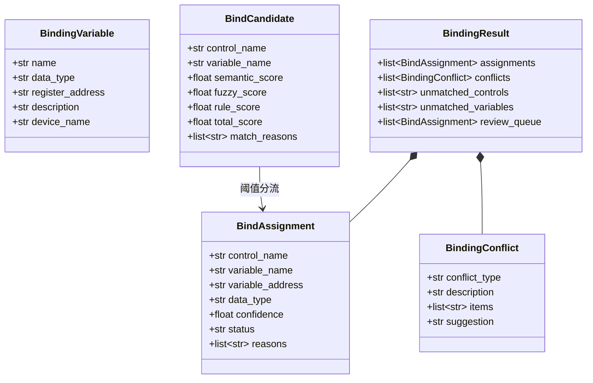
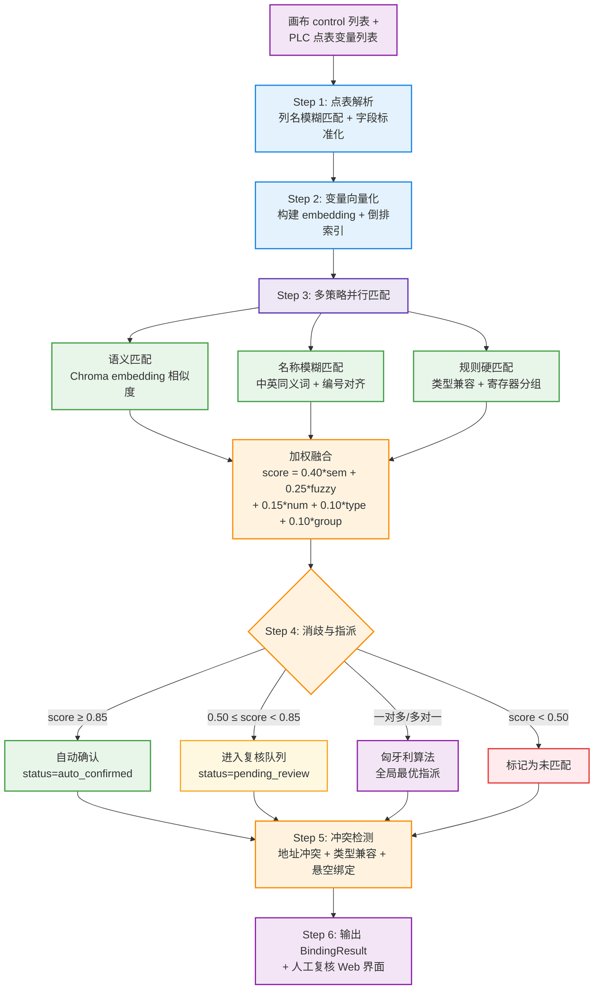
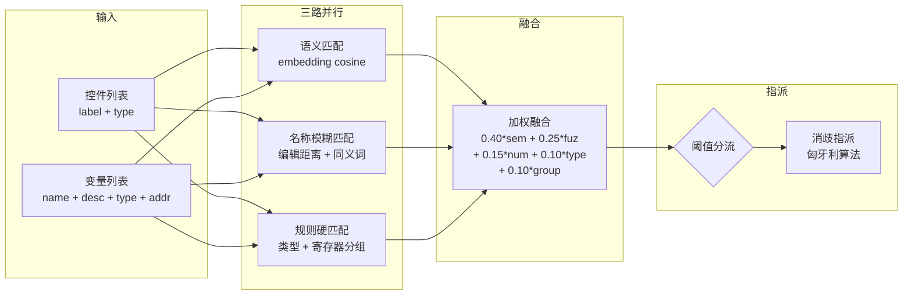
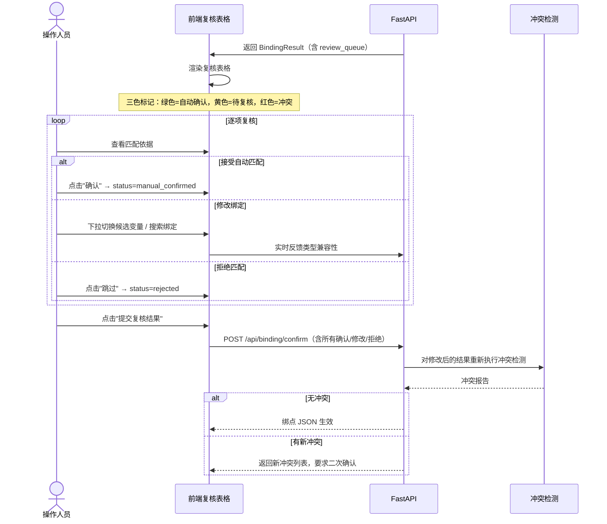
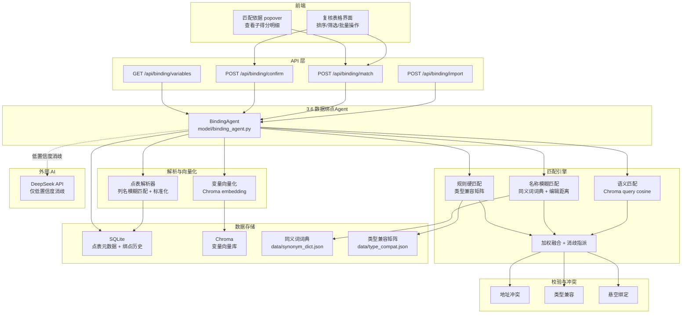

# 3.6 数据绑点 Agent

## 3.6.1 概述

数据绑点 Agent 是系统中复杂度最高的模块。与其他 Agent 不同（其他 Agent 本质是 LLM **生成**任务），绑点 Agent 本质是一个**多维度匹配决策**问题——需要在语义空间、名称空间、规则空间三个域同时对齐画布控件与 PLC 变量，并在一对多/多对一/零匹配等不确定性场景下做出最优指派。

**核心难点：**

| 难点 | 说明 |
|------|------|
| 语义鸿沟 | 控件 label 为中文（"水泵1运行状态灯"），PLC 变量名为英文/拼音缩写（`Pump_01_Run`），需跨语言对齐 |
| 多维度融合 | 语义相似度、名称模糊匹配、设备编号对齐、数据类型兼容、寄存器分组一致性，五维评分融合与阈值调优极为敏感 |
| 双向不确定性 | 一个控件可能匹配多个变量，一个变量可能无对应控件，匹配关系非简单二分 |
| 人机协同为必须路径 | 绑点结果必须经人工复核方可生效，复核流程是第一等设计要素，非兜底方案 |

**核心职责：** 将画布控件与 PLC 点表变量进行多策略语义匹配，输出含置信度的绑点候选、冲突报告和人工复核队列。

**输入输出：**

| 项目 | 内容 |
|------|------|
| 输入 | 画布 control 列表 + 解析后的 PLC 点表变量列表 + 已有绑点快照（增量绑点时） |
| 输出 | `BindingResult`：匹配列表 + 冲突列表 + 未匹配项 + 人工复核队列 + 匹配依据 |

---

## 3.6.2 核心数据模型

**实现位置：** `app/schemas.py:84-114`（已有基础），`model/binding_agent.py`（待创建）



### BindingVariable

解析后的 PLC 点表变量。

| 字段 | 类型 | 说明 |
|------|------|------|
| `name` | str | 变量名，如 `Pump_01_Run` |
| `data_type` | str | 数据类型：`bool` / `int16` / `int32` / `float` / `string` |
| `register_address` | str | 寄存器地址，如 `40001.0` |
| `description` | str | 变量描述，如 "水泵1运行反馈" |
| `device_name` | str | 所属设备名称，如 "水泵1" |

### BindCandidate

单条匹配候选（中间结果，不对外暴露）。

| 字段 | 类型 | 说明 |
|------|------|------|
| `control_name` | str | 控件名称 |
| `variable_name` | str | 候选变量名 |
| `semantic_score` | float | 语义相似度得分（0~1） |
| `fuzzy_score` | float | 名称模糊匹配得分（0~1） |
| `rule_score` | float | 规则匹配得分（0~1） |
| `total_score` | float | 组合加权得分 |
| `match_reasons` | list[str] | 匹配依据列表（可解释性） |

### BindAssignment

最终确认或待复核的绑点条目。

| 字段 | 类型 | 说明 |
|------|------|------|
| `control_name` | str | 控件名称 |
| `variable_name` | str | 绑定的变量名 |
| `variable_address` | str | 寄存器地址 |
| `data_type` | str | 数据类型 |
| `confidence` | float | 综合置信度（0~1） |
| `status` | str | `auto_confirmed` / `pending_review` / `manual_confirmed` / `rejected` |
| `reasons` | list[str] | 匹配依据 |

### BindingConflict

冲突检测结果。

| 字段 | 类型 | 说明 |
|------|------|------|
| `conflict_type` | str | 冲突类型：`duplicate_address` / `duplicate_variable` / `type_mismatch` / `orphan_control` / `invalid_variable` / `invalid_property` |
| `description` | str | 冲突描述 |
| `items` | list[str] | 涉及的控件/变量名列表 |
| `suggestion` | str | 修复建议 |

### BindingResult

Agent 最终返回结果。

| 字段 | 类型 | 说明 |
|------|------|------|
| `assignments` | list[BindAssignment] | 所有绑点分配（含状态） |
| `conflicts` | list[BindingConflict] | 冲突列表 |
| `unmatched_controls` | list[str] | 未匹配到变量的控件名列表 |
| `unmatched_variables` | list[str] | 未被任何控件绑定的变量名列表 |
| `review_queue` | list[BindAssignment] | 待人工复核的绑点（status=pending_review） |

---

## 3.6.3 核心流程

数据绑点分为 6 个步骤，其中 Step 3（匹配策略）为核心：

1. **Step 1 — 点表解析与标准化**：上传 Excel 点表，模糊识别列名，抽取并标准化变量字段
2. **Step 2 — 变量向量化与索引**：将变量描述构建为 embedding 写入 Chroma，同时构建名称倒排索引
3. **Step 3 — 多策略并行匹配**：语义匹配 + 名称模糊匹配 + 规则硬匹配，三路并行后加权融合
4. **Step 4 — 消歧与指派**：处理一对多/多对一冲突，使用贪心或匈牙利算法做最优指派
5. **Step 5 — 冲突检测**：硬规则扫描（地址冲突、类型不兼容、悬空绑定等）
6. **Step 6 — 人工复核与确认**：Web 表格界面展示候选，支持批量确认、单条修正、重新检测



---

## 3.6.4 点表解析策略

### 列名模糊匹配

Excel 点表的上传者可能使用不同的列名规范，系统通过**列别名映射表**进行模糊匹配：

| 原始列名（示例） | 标准字段 |
|-----------|----------|
| 变量名、TagName、点名、名称、Tag | `variable_name` |
| 数据类型、类型、DataType、数据类别 | `data_type` |
| 地址、寄存器、Register、Address、Addr | `register_address` |
| 描述、说明、备注、变量描述 | `description` |
| 单位、Unit、工程单位 | `unit` |
| 所属设备、设备名称、DeviceName | `device_name` |
| 上限、量程上限、RangeHigh | `range_high` |
| 下限、量程下限、RangeLow | `range_low` |

匹配策略：

```text
1. 加载列别名映射表（配置在 data/column_alias.json）
2. 对 Excel 表头的每个列名执行：
   a. 精确匹配 → 直接映射
   b. 去除空格/下划线/横线后小写匹配 → 模糊命中
   c. 包含关系匹配（"变量名称" 包含 "变量名"）→ 模糊命中
3. 无法识别列 → 记录到解析报告，提示人工确认
4. Sheet 识别：优先读取名为 "DI"/"DO"/"AI"/"AO"/"变量表"/"点表" 的 Sheet
```

### 数据标准化

解析后的变量进入标准化处理：

```text
1. 数据类型归一化：
   - bool/boolean/bit → bool
   - int16/int/short/word → int16
   - int32/dint/dword/long → int32
   - float/real/single → float
   - string/char → string

2. 寄存器地址标准化：
   - Modbus: 40001 → 40001
   - 位地址: 40001.0 / 40001:0 → 统一为 "40001.0"
   - 十六进制: 0x9C41 → 转十进制存储，保留原始值

3. 变量名语义增强：
   "Pump_01_Run" → 生成三个变体用于检索:
     - 原始: "Pump_01_Run"
     - 分词: "pump 01 run"
     - 中文映射: "水泵 1 运行"
```

### 输出示例

```json
{
  "parse_report": {
    "total_rows": 156,
    "parsed_count": 152,
    "unmapped_columns": ["自定义字段A"],
    "skipped_rows": 4
  },
  "variables": [
    {
      "name": "Pump_01_Run",
      "data_type": "bool",
      "register_address": "40001.0",
      "description": "水泵1运行反馈",
      "device_name": "水泵1",
      "unit": "",
      "source": {
        "file": "水泵站点表.xlsx",
        "sheet": "DI",
        "row": 3
      }
    }
  ]
}
```

---

## 3.6.5 匹配策略

这是整个绑点 Agent 最核心的部分。匹配采用**三路并行 + 加权融合 + 全局指派**架构。

### 3.6.5.1 匹配架构总览



### 3.6.5.2 语义匹配

将控件和变量的文本描述分别向量化，在 Chroma 中计算余弦相似度。

**控件端 embedding 文本构造：**

```text
控件 label: "水泵1运行状态灯"
控件 type: "indicator_light"
→ embedding_text: "设备类型:水泵 状态:运行 控件类型:指示灯 工业组态控件"
```

**变量端 embedding 文本构造：**

```text
变量名: "Pump_01_Run"
描述: "水泵1运行反馈"
数据类型: "bool"
→ embedding_text: "变量 Pump_01_Run 表示水泵1运行反馈，数据类型 bool，寄存器地址 40001.0"
```

**检索方式：**

```python
# 方案 A：控件→变量单向检索（每个控件在变量向量库中检索 Top-3）
for control in controls:
    candidates = chroma_collection.query(
        query_embeddings=[control_embedding],
        n_results=3,
        where={"chunk_type": "plc_variable"}
    )

# 方案 B：双向交叉检索矩阵（N×M 全量计算，用于高精度场景）
# 构建 N×M 相似度矩阵，每行/每列取 Top-K
```

**相似度归一化：**

```text
cosine_sim ∈ [-1, 1] → 映射到 [0, 1]
若 cosine_sim < 0.3 → 置 0（低相关直接截断）
semantic_score = max(0, (cosine_sim + 1) / 2)
```

### 3.6.5.3 名称模糊匹配

不需要 embedding 模型，纯字符串/词典驱动的快速匹配。

**中文 ↔ 英文同义词词典：**

```json
{
  "运行": ["run", "running", "start"],
  "停止": ["stop", "halt"],
  "故障": ["fault", "alarm", "error", "trip"],
  "启动": ["start", "start_cmd"],
  "急停": ["emergency_stop", "e_stop"],
  "开度": ["opening", "position", "feedback"],
  "电流": ["current", "amp"],
  "频率": ["frequency", "hz", "speed"],
  "压力": ["pressure", "press"],
  "流量": ["flow", "flow_rate"],
  "液位": ["level", "liquid_level"],
  "温度": ["temperature", "temp"],
  "状态": ["status", "state", "run"],
  "控制": ["control", "ctrl", "cmd"],
  "反馈": ["feedback", "fb", "status"],
  "手动": ["manual", "man"],
  "自动": ["auto", "automatic"],
  "远程": ["remote", "rem"],
  "就地": ["local", "loc"],
  "水泵": ["pump"],
  "阀门": ["valve"],
  "风机": ["fan"],
  "电机": ["motor"],
  "变频器": ["vfd", "inverter"]
}
```

**编号对齐：**

```text
控件: "水泵1" → 提取编号 "1"
控件: "Pump_01" → 提取编号 "01" → 归一化为 "1"
变量: "Pump_01_Run" → 提取编号 "01" → 归一化为 "1"
→ 编号匹配 = 1.0
```

**模糊匹配评分：**

```python
def fuzzy_match(control_name: str, variable_name: str) -> float:
    cn = normalize(control_name)  # 去空格、下划线、横线、小写
    vn = normalize(variable_name)

    # 1. 精确匹配
    if cn == vn:
        return 1.0

    # 2. 包含关系
    if cn in vn or vn in cn:
        return 0.85

    # 3. 编辑距离（Levenshtein）
    dist = levenshtein_distance(cn, vn)
    max_len = max(len(cn), len(vn))
    edit_score = 1.0 - (dist / max_len)
    if edit_score < 0.3:
        return 0.0
    return edit_score * 0.7  # 上限 0.7，为同义词留空间
```

**名称模糊匹配总分：**

```text
fuzzy_score = 0.50 * 同义词命中分
            + 0.25 * 编辑距离分
            + 0.25 * 编号对齐分
```

同义词命中分计算：

```text
对控件 label 进行中文分词
对变量名按下划线/大小写分词
统计两个分词集合中命中同义词典的 token 对数量
命中率 = 命中对数 / max(控件token数, 变量token数)
同义词分 = min(1.0, 命中率 * 1.2)
```

### 3.6.5.4 规则硬匹配

不依赖相似度，基于硬性规则的兼容性判断。

**数据类型兼容矩阵：**

| 控件期望类型 | bool | int16 | int32 | float | string |
|-------------|------|-------|-------|-------|--------|
| indicator_light（指示灯） | ✅ 1.0 | ✅ 0.8 | ✅ 0.8 | ❌ 0.0 | ❌ 0.0 |
| text（文本显示） | ✅ 0.8 | ✅ 1.0 | ✅ 1.0 | ✅ 1.0 | ✅ 1.0 |
| button（按钮） | ✅ 1.0 | ✅ 0.5 | ✅ 0.5 | ❌ 0.0 | ❌ 0.0 |
| flow_meter（流量计） | ❌ 0.0 | ✅ 1.0 | ✅ 1.0 | ✅ 1.0 | ❌ 0.0 |
| valve（阀门） | ✅ 1.0 | ✅ 0.8 | ✅ 0.8 | ❌ 0.0 | ❌ 0.0 |
| pump（水泵） | ✅ 1.0 | ❌ 0.0 | ✅ 0.5 | ❌ 0.0 | ❌ 0.0 |

**寄存器分组一致性：**

```text
将变量按寄存器地址前缀分组（如 40001~40100 为一组）
同一设备类型的控件倾向于绑定同一寄存器分组的变量
→ 若候选变量与已确认绑定的同设备变量在同一寄存器分组：+0.3 加分
→ 若在不同分组：-0.2 扣分
```

**规则得分汇总：**

```text
rule_score = 0.60 * 类型兼容分
           + 0.40 * 寄存器分组一致性分
```

### 3.6.5.5 加权融合

五维评分融合公式：

```text
total_score = 0.40 × semantic_score    # 语义向量相似度
            + 0.25 × fuzzy_score       # 名称字面匹配 + 同义词
            + 0.15 × number_score      # 设备编号对齐
            + 0.10 × type_score        # 数据类型兼容
            + 0.10 × group_score       # 寄存器分组一致性
```

各项子分均为 [0, 1] 归一化值。

**权重设计依据：**

| 权重 | 维度 | 设计理由 |
|------|------|---------|
| 0.40 | 语义相似度 | 最可靠——跨语言、跨命名规范的深层语义对齐，embedding 模型已编码工业领域知识 |
| 0.25 | 名称模糊匹配 | 次可靠——同一设备/供应商倾向于使用一致的命名模式，但易受缩写、拼写差异影响 |
| 0.15 | 编号对齐 | 中可靠——大部分规范点表使用编号，但非强制 |
| 0.10 | 类型兼容 | 辅助——排除明显不兼容的匹配，但部分控件类型可兼容多种数据类型 |
| 0.10 | 寄存器分组 | 弱信号——寄存器分组规律依赖点表设计者的习惯，仅作微调 |

### 3.6.5.6 阈值分流与消歧指派

**三区阈值体系：**

```text
score ≥ 0.85  → 高置信区：自动确认（auto_confirmed）
               进入冲突检测，无误则直接生效

0.50 ≤ score < 0.85 → 候选区：进入人工复核队列（pending_review）
               前端表格默认选中 Top-1，人力可修改

score < 0.50 → 拒绝区：不匹配（unmatched）
               控件进入 unmatched_controls 列表
               可在复核界面手动强制绑定
```

**一对多/多对一消歧（匈牙利算法）：**

当多个控件竞逐同一个变量（或反之），需要在全局做最优指派：

```text
输入：N 个控件 × M 个变量的 N×M 得分矩阵 S
约束：每个控件最多绑定 1 个变量，每个变量最多被 1 个控件绑定
目标：最大化总得分 Σ S[i, j] × X[i, j]，其中 X[i, j] ∈ {0, 1}

算法：
1. 对得分矩阵 S，运用 Hungarian Algorithm（KM 算法）
2. 仅对 score ≥ 0.50 的候选项参与指派
3. 未被匈牙利算法选中的候选项，若其 score ≥ 0.85，标记为 "被挤出" 并单独提示
4. 若 N ≠ M（控件数与变量数不等）：
   - 补零行/列将矩阵变为方阵
   - 指派后去除补零对应项
```

**LLM 辅助消歧（低置信度专项）：**

LLM 仅用于以下场景，不作为主力匹配引擎：

```text
触发条件：
  - 经过三路匹配 + 匈牙利指派后，仍存在 score ∈ [0.50, 0.85) 的待复核项
  - 且 fuzzy_score < 0.3（名称匹配极弱）但 semantic_score > 0.6（语义接近）

LLM Prompt：
  "你是 SCADA 绑点语义分析器。控件'{control_label}'与候选变量:
   {variable_list}
   请分析语义匹配关系，输出最佳匹配及理由。若无法确定则返回 null。"

LLM 输出作为候选加分项（+0.05 ~ +0.15），不改变主匹配路径。
```

---

## 3.6.6 冲突检测

在所有绑点分配完成后，执行硬规则冲突扫描。

### 冲突类型与检测规则

| 冲突类型 | 检测规则 | 严重度 |
|---------|---------|--------|
| `duplicate_address` | 同一寄存器地址被 ≥2 个不同控件绑定 | `error` |
| `duplicate_variable` | 同一变量名在点表中重复出现 | `warning` |
| `type_mismatch` | 控件的期望数据类型与变量数据类型不兼容（兼容矩阵返回 0） | `error` |
| `orphan_control` | 控件需要绑点（type 非 panel/text 等纯装饰类）但未匹配到任何变量 | `warning` |
| `invalid_variable` | 绑点引用的变量不存在于点表中 | `error` |
| `invalid_property` | binding.property 不在枚举字典 `binding_property` 中 | `error` |
| `address_overlap` | 两个变量寄存器地址范围重叠（如 int32 变量占用 40001-40002，另一个 int16 使用 40002） | `warning` |

### 冲突报告示例

```json
{
  "conflicts": [
    {
      "conflict_type": "duplicate_address",
      "description": "寄存器地址 40010 被 3 个控件绑定",
      "items": [
        "水泵1运行状态 -> Pump_01_Run",
        "水泵1故障状态 -> Pump_01_Run", 
        "水泵1启停按钮 -> Pump_01_Start"
      ],
      "suggestion": "Pump_01_Run 被同时绑定给运行状态和故障状态两个控件，请确认是否为冗余显示。若非冗余，请检查寄存器地址是否有误。"
    },
    {
      "conflict_type": "type_mismatch", 
      "description": "流量计控件期望数值类型，但绑定了 bool 变量",
      "items": ["流量显示 -> Pump_01_Run (bool)"],
      "suggestion": "流量计控件需要绑定 float 或 int 类型变量，当前变量 Pump_01_Run 为 bool 类型。请核对变量或控件类型。"
    }
  ]
}
```

### 冗余显示豁免

以下场景的 duplicate_address 标记为 `info` 而非 `error`：

```text
1. 同一变量被两个相同类型控件绑定（如两个指示灯都显示 "运行状态"）→ info: "冗余显示"
2. 同一变量被一个指示灯和一个文本控件绑定（前者改颜色，后者显示文字值）→ info: "多属性绑定"
3. int32 变量被拆分为两个 int16 控件显示高低位 → info: "高低位拆分显示"
```

---

## 3.6.7 人工复核流程

绑点结果的人工复核是整个模块的**必须路径**，非可选步骤。

### 复核界面设计



### 表格行状态

| 状态 | 颜色标记 | 说明 |
|------|---------|------|
| `auto_confirmed` | 绿色 | 置信度 ≥0.85，自动确认，可直接批量接受 |
| `pending_review` | 黄色 | 0.50 ≤ 置信度 < 0.85，需人工确认 |
| `manual_confirmed` | 蓝色 | 人工已确认 |
| `manual_modified` | 蓝色（斜体） | 人工修改过绑定目标 |
| `rejected` | 灰色 | 人工标记为不绑定 |
| `conflict` | 红色 | 冲突检测未通过 |

### 交互能力

```text
1. 排序/筛选：
   - 按状态（只看待复核 / 只看冲突）
   - 按设备类型（只看水泵 / 只看阀门）
   - 按置信度升序（低置信度优先处理）

2. 单条操作：
   - 下拉框切换绑定变量（候选列表按 score 降序排列）
   - 搜索框快速定位变量
   - 查看匹配依据 popover（semantic_score / fuzzy_score / rule_score 明细）
   - 手动输入变量名（强制绑定，标记为 manual_forced）
   - 标记为"不绑定"（unbind）

3. 批量操作：
   - 全选 + 一键确认所有 auto_confirmed 项
   - 全选 + 一键确认所有 pending_review 项（慎用）

4. 提交前校验：
   - 提交时对所有修改过的绑定重新执行冲突检测
   - 若有新冲突，阻止提交并高亮冲突行
```

---

## 3.6.8 匹配依据可解释性

每个匹配结果必须携带可读依据，便于人工复核时快速判断。

```json
{
  "control_name": "水泵1运行状态灯",
  "variable_name": "Pump_01_Run",
  "confidence": 0.91,
  "status": "auto_confirmed",
  "reasons": [
    "控件标签包含'水泵1'，变量所属设备为'水泵1'",
    "变量名 Pump_01 编号 01 与 水泵1 编号 1 一致（前缀不同）",
    "'运行'与变量名中'Run'为同义词（同义词词典命中）",
    "控件类型 indicator_light 与变量 bool 类型兼容",
    "语义相似度 0.88（Chroma embedding）"
  ]
}
```

---

## 3.6.9 API 接口

### 点表上传与解析

**`POST /api/binding/import`**

上传 Excel 点表并解析。

**请求：** `multipart/form-data`

| 参数 | 类型 | 说明 |
|------|------|------|
| `file` | file | Excel 文件（.xlsx / .xls） |
| `project_id` | str | 项目 ID |

**响应：**

```json
{
  "code": 0,
  "data": {
    "file_id": "point_table_20260607_001",
    "parse_report": {
      "total_rows": 156,
      "parsed_count": 152,
      "unmapped_columns": ["自定义字段A"],
      "sheet_used": "DI"
    },
    "variables": [
      {
        "name": "Pump_01_Run",
        "data_type": "bool",
        "register_address": "40001.0",
        "description": "水泵1运行反馈",
        "device_name": "水泵1"
      }
    ]
  }
}
```

---

### 绑点匹配生成

**`POST /api/binding/match`**

执行画布控件与点表变量的匹配。

**请求：**

```json
{
  "project_id": "project_001",
  "canvas_json": {
    "control": [
      { "id": "pump_01", "type": "pump", "label": "水泵1", "x": 420, "y": 420, "width": 120, "height": 100 },
      { "id": "status_01", "type": "indicator_light", "label": "水泵1运行状态灯", "x": 640, "y": 400, "width": 30, "height": 30 },
      { "id": "flow_01", "type": "flow_meter", "label": "流量显示", "x": 640, "y": 500, "width": 80, "height": 120 }
    ],
    "binding": []
  },
  "variables": [
    { "name": "Pump_01_Run", "data_type": "bool", "register_address": "40001.0", "description": "水泵1运行反馈" },
    { "name": "Flow_01", "data_type": "float", "register_address": "40003", "description": "流量计数值" }
  ]
}
```

**响应：**

```json
{
  "code": 0,
  "data": {
    "assignments": [
      {
        "control_name": "水泵1运行状态灯",
        "variable_name": "Pump_01_Run",
        "variable_address": "40001.0",
        "data_type": "bool",
        "confidence": 0.91,
        "status": "auto_confirmed",
        "reasons": [
          "控件标签包含'水泵1'，变量所属设备为'水泵1'",
          "'运行'与'Run'为同义词",
          "语义相似度 0.88"
        ]
      },
      {
        "control_name": "流量显示",
        "variable_name": "Flow_01",
        "variable_address": "40003",
        "data_type": "float",
        "confidence": 0.87,
        "status": "auto_confirmed",
        "reasons": [
          "'流量'与变量 Flow 语义匹配",
          "控件 flow_meter 与 float 类型兼容",
          "语义相似度 0.92"
        ]
      }
    ],
    "conflicts": [],
    "unmatched_controls": ["水泵1"],
    "unmatched_variables": [],
    "review_queue": []
  }
}
```

---

### 绑点确认提交

**`POST /api/binding/confirm`**

提交人工复核后的绑点结果。

**请求：**

```json
{
  "project_id": "project_001",
  "assignments": [
    {
      "control_name": "水泵1运行状态灯",
      "variable_name": "Pump_01_Run",
      "variable_address": "40001.0",
      "data_type": "bool",
      "confidence": 0.91,
      "status": "manual_confirmed"
    },
    {
      "control_name": "流量显示",
      "variable_name": "Flow_01",
      "variable_address": "40003",
      "data_type": "float",
      "confidence": 0.87,
      "status": "manual_confirmed"
    },
    {
      "control_name": "水泵1",
      "variable_name": "",
      "status": "rejected"
    }
  ]
}
```

**响应：**

```json
{
  "code": 0,
  "data": {
    "binding_json": {
      "binding": [
        { "controlId": "status_01", "property": "status", "variable": "Pump_01_Run", "dataType": "bool", "registerAddress": "40001.0" },
        { "controlId": "flow_01", "property": "value", "variable": "Flow_01", "dataType": "float", "registerAddress": "40003" }
      ]
    },
    "final_conflicts": [],
    "saved_at": "2026-06-07T10:30:00Z"
  }
}
```

---

### 变量列表查询

**`GET /api/binding/variables?project_id=project_001`**

获取某项目已解析的点表变量列表。

**响应：**

```json
{
  "code": 0,
  "data": {
    "total": 152,
    "variables": [
      {
        "name": "Pump_01_Run",
        "data_type": "bool",
        "register_address": "40001.0",
        "description": "水泵1运行反馈",
        "device_name": "水泵1"
      }
    ]
  }
}
```

---

## 3.6.10 模块依赖关系



### 依赖关系说明

| 依赖方 | 被依赖方 | 关系 |
|--------|---------|------|
| `BindingAgent` | 点表解析器 | 调用 Excel 解析和列名匹配 |
| `BindingAgent` | Chroma 向量库 | 写入变量 embedding + 检索候选 |
| `BindingAgent` | 同义词词典 | 名称模糊匹配时查询中英对照 |
| `BindingAgent` | 类型兼容矩阵 | 规则匹配时查询类型兼容性 |
| `BindingAgent` | DeepSeek API | 仅在低置信度消歧时调用（非主力引擎） |
| `POST /api/binding/import` | `BindingAgent` | 对外暴露点表上传解析 |
| `POST /api/binding/match` | `BindingAgent` | 对外暴露匹配生成 |
| `POST /api/binding/confirm` | `BindingAgent` | 对外暴露复核提交 |
| 前端复核表格 | `POST /api/binding/match` | 获取匹配结果渲染表格 |
| 前端复核表格 | `POST /api/binding/confirm` | 提交人工复核后结果 |

### 与其他 Agent 的交互

| 上游 | 交互内容 | 时机 |
|------|---------|------|
| 3.3 控件素材 Agent | 提供控件列表（displayName/type） | 绑点匹配前，画布组装阶段 |
| 3.4 自动布局 Agent | 提供画布 control 列表（含 id/label/type） | 布局完成后，绑点匹配前 |
| 3.5 人机微调 Agent | 若微调增删控件，触发增量绑点（仅对新控件匹配） | 微调接受后 |

---

## 3.6.11 配置与环境变量

### 环境变量

| 变量 | 用途 | 必填 | 默认值 |
|------|------|------|--------|
| `DEEPSEEK_API_KEY` | DeepSeek API 密钥（仅用于低置信度消歧） | ❌ | — |
| `DEEPSEEK_BASE_URL` | API 地址 | ❌ | `https://api.deepseek.com` |
| `DEEPSEEK_MODEL` | 模型名称 | ❌ | — |

### 配置项

**定义位置：** `app/config.py`

| 配置项 | 默认值 | 说明 |
|--------|--------|------|
| `binding_auto_threshold` | 0.85 | 自动确认阈值（≥此值自动确认） |
| `binding_review_threshold` | 0.50 | 候选阈值（≥此值进入复核队列） |
| `binding_semantic_weight` | 0.40 | 语义相似度权重 |
| `binding_fuzzy_weight` | 0.25 | 名称模糊匹配权重 |
| `binding_number_weight` | 0.15 | 编号对齐权重 |
| `binding_type_weight` | 0.10 | 类型兼容权重 |
| `binding_group_weight` | 0.10 | 寄存器分组权重 |
| `binding_max_candidates` | 3 | 每个控件的最大候选变量数 |
| `synonym_dict_path` | `data/synonym_dict.json` | 同义词词典路径 |
| `type_compat_path` | `data/type_compat.json` | 类型兼容矩阵路径 |
| `column_alias_path` | `data/column_alias.json` | 列名别名映射路径 |

---

## 3.6.12 日志规范

绑点 Agent 各阶段输出统一日志格式：

| 日志事件 | 内容 | 级别 |
|---------|------|------|
| 点表解析 | `📄 点表解析: sheet=DI rows=156 parsed=152 unmapped_cols=[自定义字段A]` | INFO |
| 向量化 | `📊 变量向量化: 152 个变量 → Chroma 耗时 2.3s` | INFO |
| 三路匹配开始 | `🔍 开始三路匹配: 25 控件 × 152 变量 = 3800 候选对` | INFO |
| 语义匹配 | `🧠 语义匹配完成: 平均相似度 0.42, 命中阈值(0.3)以上 847 对` | INFO |
| 名称匹配 | `📝 名称模糊匹配完成: 同义词命中 132 对, 精确匹配 18 对` | INFO |
| 规则匹配 | `📏 规则匹配完成: 类型兼容 2014 对, 寄存器分组命中 523 对` | INFO |
| 融合指派 | `🎯 融合指派完成: auto_confirmed=18 pending=5 unmatched=2` | INFO |
| 冲突检测 | `⚠️ 冲突检测: duplicate_address=2 type_mismatch=1 orphan=3` | WARNING |
| LLM 消歧 | `🤖 LLM 消歧: 低置信度项 3 个, 消歧成功 2 个, 耗时 1.8s` | INFO |
| 人工确认 | `👍 绑点确认: 18 自动 + 5 人工确认 = 23 绑定, rejected=2` | INFO |
| 二次冲突 | `🚫 提交阻断: 人工修改后产生新冲突 duplicate_address=1, 要求二次确认` | WARNING |

---

## 3.6.13 与 PRD 差距分析

对照 `项目文档.md` 3.5 节（数据绑点）要求：

| 功能 | PRD 要求 | 当前状态 | 说明 |
|------|---------|---------|------|
| 清单解析 | 支持上传 Excel，模糊匹配列名，提取关键字段，准确率 ≥95% | ❌ 未实现 | 需实现 `POST /api/binding/import` + Excel 解析器 |
| 语义匹配 | 基于 embedding 自动关联控件与变量，输出候选列表 | ❌ 未实现 | 需实现三路匹配引擎 |
| 模糊匹配 | 控件 label 与变量名跨语言匹配（"水泵1"↔"Pump_01"），输出匹配依据 | ❌ 未实现 | 需实现同义词词典 + 编号对齐 |
| 冲突检测 | 识别寄存器地址冲突、变量重复，检测准确率 100% | ⚠️ 基础实现 | 当前 `binding.py` 仅有简单的地址重复检测，缺少类型兼容、悬空绑定等 |
| 复核界面 | Web 表格复核界面，支持手动修改/确认，操作便捷 | ❌ 未实现 | 需开发复核表格前端组件 |
| 自动匹配准确率 | Top-1 准确率 ≥75%（人工评审） | — | 待验证 |
| 绑点 JSON 输出 | 通过 Schema 校验 | — | 待验证 |
| 3 条冲突场景 | 能正确识别 3 条预置冲突场景 | — | 待验收 |

---

## 3.6.14 总流程图

```mermaid
---
config:
  layout: dagre
  themeVariables:
    fontSize: 18px
---
flowchart TB
    UPLOAD["用户上传 Excel 点表"] --> IMPORT["POST /api/binding/import<br/>列名模糊匹配 + 标准化"]
    IMPORT --> STORE_1[("写入 SQLite<br/>变量元数据")]
    IMPORT --> EMBED["变量向量化<br/>写入 Chroma"]

    LAYOUT["布局生成完成<br/>提供 control 列表"] --> MATCH["POST /api/binding/match"]

    EMBED --> MATCH
    STORE_1 --> MATCH

    MATCH --> THREE["三路并行匹配"]
    THREE --> FUSE["加权融合 + 消歧指派"]

    FUSE --> THRESHOLD{"阈值分流"}
    THRESHOLD -->|"≥0.85"| AUTO["自动确认"]
    THRESHOLD -->|"0.5~0.85"| QUEUE["复核队列"]
    THRESHOLD -->|"<0.50"| UNMATCHED["未匹配"]

    AUTO --> DETECT["冲突检测<br/>地址/类型/悬空"]
    QUEUE --> DETECT
    UNMATCHED --> DETECT

    DETECT --> RESULT["BindingResult\n返回给前端"]

    RESULT --> TABLE["复核表格界面<br/>人工逐项确认/修改"]

    TABLE --> CONFIRM["POST /api/binding/confirm<br/>提交复核结果"]

    CONFIRM --> RECHECK["重新冲突检测"]
    RECHECK -->|"无冲突"| SAVE[("保存绑点 JSON<br/>写入 SQLite")]
    RECHECK -->|"有新冲突"| TABLE

    SAVE --> DONE["绑点完成<br/>绑点 JSON 生效"]

    style UPLOAD fill:#f3e5f5,stroke:#8e24aa,stroke-width:2px
    style IMPORT fill:#e3f2fd,stroke:#1e88e5,stroke-width:2px
    style EMBED fill:#e3f2fd,stroke:#1e88e5,stroke-width:2px
    style MATCH fill:#ede7f6,stroke:#5e35b1,stroke-width:2px
    style THREE fill:#e8f5e9,stroke:#43a047,stroke-width:2px
    style FUSE fill:#fff3e0,stroke:#fb8c00,stroke-width:2px
    style THRESHOLD fill:#fff3e0,stroke:#fb8c00,stroke-width:2px
    style AUTO fill:#c8e6c9,stroke:#43a047,stroke-width:2px
    style QUEUE fill:#fff8e1,stroke:#f9a825,stroke-width:2px
    style UNMATCHED fill:#ffcdd2,stroke:#e53935,stroke-width:2px
    style DETECT fill:#fff3e0,stroke:#fb8c00,stroke-width:2px
    style TABLE fill:#ede7f6,stroke:#5e35b1,stroke-width:2px
    style CONFIRM fill:#e3f2fd,stroke:#1e88e5,stroke-width:2px
    style RECHECK fill:#fff3e0,stroke:#fb8c00,stroke-width:2px
    style SAVE fill:#e8f5e9,stroke:#43a047,stroke-width:2px
    style DONE fill:#f3e5f5,stroke:#8e24aa,stroke-width:2px

---

## 3.6.15 性能设计说明

### 后端性能（≤500ms、跨平台）

本模块为系统中计算密度最高的模块，执行 N 个控件 × M 个变量的全量匹配。以下按典型规模（n=200 控件，m=2000 变量）预估：

| 步骤 | 算法 | 复杂度 | 耗时预算 |
|------|------|--------|---------|
| 语义匹配（Chroma batch query） | 批量向量检索，每控件 Top-3 候选 | O(n×log m) Chroma 内部 | ≤500ms |
| 名称模糊匹配 | 同义词词典 + Levenshtein 编辑距离 + 编号对齐 | O(n×m) | ≤200ms |
| 规则硬匹配 | 类型兼容矩阵查表 + 寄存器分组 | O(n×m) | ≤50ms |
| 加权融合 + 消歧指派 | 匈牙利算法（KM），k 为候选数 ≤3×n | O(k³) | ≤50ms |
| 冲突检测 | 地址冲突 + 类型兼容 + 悬空绑定扫描 | O(n) | ≤30ms |
| **全链路不含 LLM** | — | — | **≤800ms** |

> 注：N×M 全量匹配场景下全链路预计 ≤800ms，略超 500ms 预算。优化方向：① 控件/变量数量上限约束（n≤200, m≤2000）；② 语义匹配结果裁剪（相似度 <0.3 直接截断减少候选数）；③ 匈牙利算法仅对冲突候选执行（多数场景 k≪3n）。

**跨平台**：Excel 解析使用 `openpyxl`（纯 Python），匹配引擎纯 Python 实现。

### 第三方依赖

| 依赖项 | 调用参数 | 降级策略 |
|-------|---------|---------|
| DeepSeek API（低置信度消歧） | 仅 `score∈[0.50,0.85)` 且 `fuzzy<0.3` 时触发 | LLM 非主力引擎，API 不可用→跳过消歧，不影响主匹配路径，该类项保持 `pending_review` 进入复核队列 |
| `bge-small-zh-v1.5`（复用 3.2） | 本地部署，写入变量 embedding 至 Chroma | 离线 Embedding，零故障率 |
| `openpyxl` | ≥3.1，pip 安装 | 纯 Python，跨平台 Excel 解析 |

**LLM 辅助定位**：本模块 LLM 仅用于低置信度专项消歧，非必须路径。即使 DeepSeek API 完全不可用，三路匹配引擎（语义+模糊+规则）仍可独立产出匹配结果，仅影响低置信度项的置信度加分（+0.05~+0.15），不影响匹配覆盖率。

**故障率保障**：
- LLM 调用失败→该类低置信度项维持原 score 进入人工复核队列，不丢失、不误绑
- 同义词词典、类型兼容矩阵、列名别名映射均为本地 JSON 文件，零外部依赖
```
